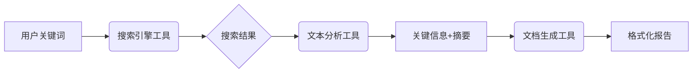

hello-agents是一个非常不错的项目，从0开始迭代式的开发一个agents框架
，其中涵盖的开发理念十分成熟，特别是开发规范。
这里《HelloAgents》第7章的一些作业。


---

## 一、主流框架的痛点：为何我们需要新架构？

当前主流 Agent 框架（如 LangChain）在实际项目中常面临四大瓶颈：

- **模块耦合度高**：组件相互依赖，难以独立升级或替换。
- **扩展性差**：新增功能需侵入核心代码，破坏原有结构。
- **缺乏统一抽象**：不同模块接口风格不一，集成成本高。
- **调试困难**：执行流程黑盒化，行为不可追踪。

这些问题在构建 RAG 问答系统时尤为突出——不仅增加重构成本，还抬高了团队的学习门槛与调试难度。

---

## 二、“万物皆为工具”：统一抽象带来的范式转变

《HelloAgents》提出 **“Everything is a Tool”** 的核心理念，将所有功能（包括规划器、记忆模块、外部 API）抽象为标准工具。

### ✅ 优势
- **统一接口**：所有工具通过 `execute()` 方法调用，调度逻辑高度一致。
- **高复用性**：同一工具可用于多个 Agent 或任务链。
- **灵活组合**：支持链式调用、条件分支、并行执行。
- **易测试调试**：每个工具可独立单元测试，输入输出可记录回放。

### ⚠️ 局限与权衡
- **性能开销**：过度抽象可能引入序列化/反序列化成本。
- **语义模糊**：复杂控制流（如 Planner）强行工具化可能导致逻辑不清。
- **流程黑箱风险**：多工具协同若缺乏可观测性，反而更难调试。

> 关键启示：**抽象不是目的，而是为了降低认知负荷与提升组合自由度**。

---

## 三、框架化设计的七大原则与五大改进

### 🛠 改进点
| 改进点 | 从零实现的 ReActAgent | 框架化的 ReActAgent | 对可维护性与可扩展性的提升 |
|--------|------------------------|----------------------|----------------------------|
| **1. 工具调用抽象** | 工具逻辑硬编码在 `run()` 中，工具列表和调用方式耦合在主流程里 | 所有工具注册到统一工具库，通过 `tool_executor` 调用，遵循“万物皆为工具”接口 | ✅ **可维护性**：修改或替换工具无需改动 Agent 核心逻辑<br>✅ **可扩展性**：新增工具只需实现标准接口并注册，无需修改 Agent 代码 |
| **2. 配置驱动行为** | 行为参数（如最大推理步数、LLM 模型）写死在代码中 | 通过 `Config` 单例加载 YAML/JSON 配置，动态控制 max_steps、model_name 等 | ✅ **可维护性**：调整策略无需重写代码<br>✅ **可扩展性**：支持多环境（dev/test/prod）快速切换配置 |
| **3. 统一日志与追踪** | 手动 print 或简单 logging，无结构化记录 | 内置事件系统，自动记录每一步的 Thought/Action/Observation，并支持回调钩子 | ✅ **可维护性**：调试时可回溯完整执行链<br>✅ **可扩展性**：可接入监控平台或可视化工具（如 LangSmith） |

### 🧭 设计原则
1. **最小化认知负担**：命名直观、接口一致、文档完备。
2. **高内聚低耦合**：每个模块职责单一，交互通过明确定义的接口。
3. **可观察性优先**：内置日志、事件钩子、调用链追踪。
4. **配置驱动**：避免硬编码，行为由外部配置定义。
5. **插件化生态**：支持第三方工具/Agent 注册，构建开放市场。
6. **渐进式增强**：核心轻量，高级功能按需加载。
7. **安全可控**：工具调用需权限校验，防止恶意执行。

---

## 四、关键设计模式解析

### 1. `Message` 类：基于 Pydantic 的结构化通信
使用 `BaseModel` 定义消息体，带来：
- 自动类型校验与默认值
- JSON 序列化/反序列化原生支持
- IDE 智能提示 + 自动生成 OpenAPI 文档
- 天然适用于 Agent 间通信、Web API、配置加载等场景

### 2. `Agent.run()` 与 `_execute()`：模板方法模式
- **`run()`**：定义通用执行流程（如日志记录、异常处理、回调触发）
- **`_execute()`**：由子类实现具体逻辑（如 ReAct 推理、Plan-and-Execute）

> 优势：行为统一、扩展灵活、减少重复代码。

### 3. `Config` 单例模式：全局配置一致性保障
- 确保整个应用只加载一份配置
- 避免内存浪费与状态冲突
- 支持热更新与集中监控

若不用单例，将导致配置碎片化、难以维护。

---

## 五、高级能力拓展：从基础 Agent 到生产级系统

### 🔗 工具链示例：智能报告生成


### ⚡ 异步工具执行：何时能提升性能？
- ✅ I/O 密集型任务（如网络请求）
- ✅ 无依赖的并行工具
- ❌ 计算密集型任务（需考虑 GIL 与 CPU 核心数）

### 💬 流式输出设计
- 新增 `stream_response()` 方法
- 结合 SSE/WebSocket 实现实时前端更新
- 将推理过程分步返回（Thought → Action → Observation）

### 🔄 多轮对话管理
- 引入 `ConversationManager` 类
- 扩展 `Message` 添加 `conversation_id`、`turn_index`
- 支持对话分支、状态回溯、上下文压缩

### 🧩 插件系统架构
```
+---------------------+
|   HelloAgents Core  |
+----------+----------+
           |
   +-------v--------+
   | Plugin Manager |
   +-------+--------+
           |
   +-------+--------+     +------------------+     +------------------+
   | Agent Plugin   |<--->| Tool Plugin      |<--->| UI/Data Plugins  |
   +----------------+     +------------------+     +------------------+
```
- 插件通过标准接口注册
- 核心框架无感知扩展
- 支持社区共建生态

---

## 结语：框架的价值在于“约束中的自由”

《HelloAgents》并非追求功能堆砌，而是通过**合理的抽象、清晰的边界与开放的扩展机制**，让开发者既能快速上手，又能灵活定制。它证明了：好的框架不是限制创造力，而是在统一范式下释放生产力。

> 未来，随着插件生态的成熟与可观测性工具的完善，《HelloAgents》有望成为构建企业级智能 Agent 系统的首选骨架。

---
