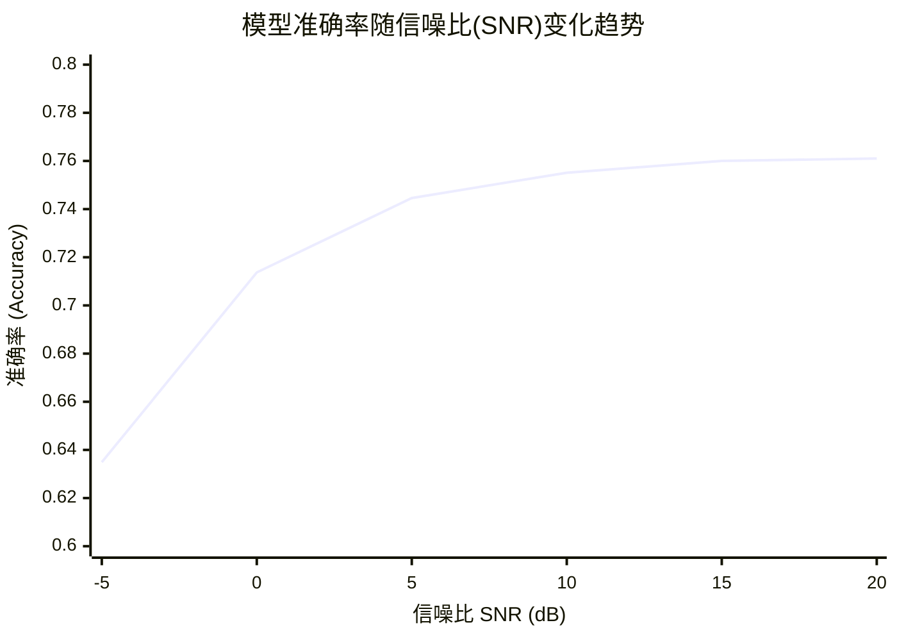
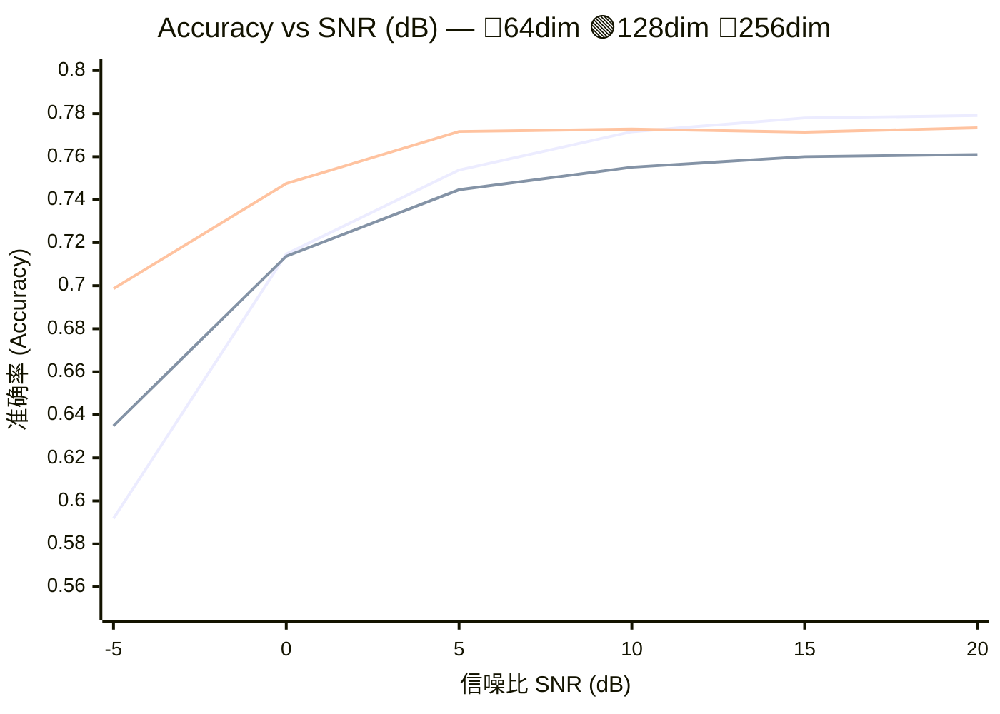

`Can JEPA-style predictive representations improve task-oriented semantic communication under noisy channels?`

中文表述：

`JEPA 式预测表征能否提升噪声信道下任务导向语义通信的鲁棒性和传输效率？`


# 第 1 周：通信和语义通信基本概念

## 1.Shannon communication mode

Shannon 通信模型关注的是：如何把发送端的信息尽可能可靠地传到接收端。经典链路可以写成：

信息源 → 信源编码 → 信道编码 → 调制/发送 → 信道 → 解调/信道译码 → 信源译码 → 目的端

它的核心目标不是“理解内容”，而是保证接收端恢复出的比特序列尽可能接近发送端。

Shannon 理论里有两个重要思想：

第一，**信源编码**负责去除冗余。例如图像压缩、视频压缩、文本压缩。它关心的是：同样的信息能不能用更少的比特表示。

第二，**信道编码**负责对抗噪声。例如加入纠错码、冗余校验，使信息即使经过噪声信道后也能恢复。

Shannon 的经典结论是：在理想条件下，信源编码和信道编码可以分开设计，这就是 separation theorem。只要传输速率低于信道容量，理论上就可以实现任意低的误码率。

一个常见的信道容量公式是：

$$
C=Blog_2(1+SNR)
$$


其中，C 是信道容量，B 是带宽，SNR 是信噪比。它说明：带宽越大、信噪比越高，理论可传输速率越高。

## 2.Source coding、channel coding、joint source-channel coding

**Source coding，信源编码**
 它的目标是压缩信息，减少冗余。比如 JPEG、H.264、H.265、AV1 都属于信源编码范畴。信源编码可以是无损的，也可以是有损的。无损压缩要求完全恢复原始数据，有损压缩允许一定失真，但希望视觉质量或感知质量尽量高。

**Channel coding，信道编码**
 它的目标是抗干扰、抗噪声、抗丢包。发送端主动加入冗余，接收端利用这些冗余纠错。典型方法包括卷积码、Turbo 码、LDPC 码、Polar 码等。信道编码不是为了压缩，而是为了提高可靠性。

**Joint source-channel coding，联合信源信道编码，JSCC**
 传统通信通常先压缩，再信道编码。而 JSCC 试图把二者合在一起优化。它不一定先生成标准比特流，而是直接把图像、语音或语义特征映射成适合信道传输的表示。深度学习语义通信里常见的 Deep JSCC 就属于这一类。它的优势是：在低 SNR 或信道变化时，性能往往是平滑下降，而不是像传统压缩码流那样一旦关键比特出错就严重崩溃。

## 3.AWGN channel、Rayleigh fading、SNR

**AWGN channel，加性白高斯噪声信道**
 AWGN 是最基础的信道模型：
$$
y = x + n
$$
其中 $x$ 是发送信号，$y$ 是接收信号，$n$ 是高斯噪声。它假设噪声是加性的、白噪声的，并服从高斯分布。AWGN 适合用来分析最基础的噪声干扰。

**Rayleigh fading，瑞利衰落信道**
 Rayleigh fading 更接近无线传播环境。它考虑多径传播：信号从不同路径到达接收端，发生叠加，有时增强，有时抵消。常见模型是：
$$
y = hx + n
$$
其中 $h$ 是随机信道增益。如果没有明显直射路径，信道幅度常用 Rayleigh 分布建模。它比 AWGN 更复杂，因为信号不仅被噪声污染，还会被随机衰落缩放。

**SNR，signal-to-noise ratio，信噪比**
 SNR 表示信号功率和噪声功率的比值：
$$
\mathrm{SNR} = \frac{P_{\text{signal}}}{P_{\text{noise}}}
$$
通常也写成 dB 形式：
$$
\mathrm{SNR_{dB}} = 10\log_{10}(\mathrm{SNR})
$$
SNR 越高，信号越清晰；SNR 越低，噪声越强，通信越困难。

## 4. Bit-level fidelity vs task-level effectiveness

传统通信更关注 **bit-level fidelity，比特级保真度**。也就是说，接收端恢复出来的比特是否和发送端完全一致。例如误码率 BER、块错误率 BLER、包丢失率 PER 都属于这类指标。

但语义通信更关注 **task-level effectiveness，任务级有效性**。它关心的是：接收端是否完成了任务，而不是是否恢复了所有原始比特。

例如，在铁路入侵检测场景中，传统通信希望把完整视频尽量清晰地传回控制中心；语义通信则可能只传“轨道区域、入侵目标类别、位置、运动方向、置信度”等任务相关信息。即使没有恢复原始视频，只要系统能准确判断“有人进入防护区”，任务就是成功的。

所以二者的根本区别是：

**传统通信：传得像不像原始数据。**
**语义通信：传过去的信息能不能支撑任务决策。**

## 5. PSNR/SSIM 与 accuracy/mAP/mIoU 的区别

**PSNR 和 SSIM** 主要用于评价图像或视频重建质量。

PSNR 关注像素误差。PSNR 越高，说明重建图像和原图在像素层面越接近。但它不一定代表视觉感受更好，也不一定代表任务效果更好。

SSIM 关注结构相似性，比如亮度、对比度、结构信息。它比 PSNR 更接近人眼感知，但本质上还是评价“重建图像像不像原图”。

而 **accuracy、mAP、mIoU** 更关注任务效果。

accuracy 常用于分类任务，表示分类正确率。

mAP 常用于目标检测任务，评价模型是否准确检测出目标类别和位置。

mIoU 常用于语义分割任务，评价预测区域和真实区域的重叠程度。

因此：

**PSNR/SSIM 是重建质量指标。**
**accuracy/mAP/mIoU 是任务性能指标。**

在语义通信中，PSNR 高不一定代表任务好。例如图像背景恢复得很清晰，PSNR 可能很高，但入侵目标被压缩模糊了，检测 mAP 反而会下降。语义通信更倾向于保护任务关键语义，而不是平均保护所有像素。


## AWGN channel

```python
def awgn(x: torch.Tensor, snr_db: float) -> torch.Tensor:
    """Add AWGN assuming x has unit average power after normalization."""
    snr_linear = 10 ** (snr_db / 10.0)
    noise_std = (1.0 / snr_linear) ** 0.5
    return x + noise_std * torch.randn_like(x)
```

在通信系统中，信噪比（SNR）的定义为信号功率与噪声功率的比值：
$$
SNR_{linear} = \frac{P_{signal}}{P_{noise}}
$$

根据代码假设，输入信号具有单位平均功率，即 $P_{signal} = 1$，因此：
$$
SNR_{linear} = \frac{1}{P_{noise}}
$$
由于噪声是**加性高斯白噪声，其功率等于其方差**，即 $P_{noise} = \sigma^2$，代入上式可得：
$$
SNR_{linear} = \frac{1}{\sigma^2}
$$

从而可以求出噪声的标准差（均方根）：
$$
\sigma = \frac{1}{\sqrt{SNR_{linear}}}
$$
而在工程应用中，SNR通常以分贝为单位给出（$SNR_{dB}$），它与线性值之间的转换关系为：
$$
SNR_{linear} = 10^{\frac{SNR_{dB}}{10}}
$$


将线性信噪比代入标准差公式，得到最终生成噪声的标准差：
$$
\sigma = \left( \frac{1}{10^{\frac{SNR_{dB}}{10}}} \right)^{0.5} = \frac{1}{\sqrt{10^{\frac{SNR_{dB}}{10}}}}
$$
最后，输出信号为原始信号加上高斯噪声：
$$
y = x + \mathcal{N}(0, \sigma^2) = x + \sigma \cdot \mathcal{N}(0, 1)
$$
这段代码非常简洁，但**非常依赖输入信号的功率确实为1**。如果传入的 `x` 实际功率不是1，那么实际输出的信噪比将不是 `snr_db`。
如果你的输入信号**没有归一化**（即功率 $P_x \neq 1$），需要将噪声标准差修改为：$$\sigma = \sqrt{\frac{P_x}{10^{\frac{SNR_{dB}}{10}}}}$$
对应的代码应修改为：

```python
def awgn_general(x: torch.Tensor, snr_db: float) -> torch.Tensor:  
    # 计算输入信号的平均功率
    sig_power = torch.mean(x ** 2)
    snr_linear = 10 ** (snr_db / 10.0)  
    # 噪声标准差需要乘以信号功率的平方根
    noise_std = (sig_power / snr_linear) ** 0.5  
    return x + noise_std * torch.randn_like(x)
```

## 额外：

对于**功率比**$（P_1/P_2）$，分贝的定义是：
$$
SNR_{dB} = 10⋅log_{10} \frac {P_1}{P_2}
 
$$
最初定义的是“贝尔（Bel）”，公式是 $Bell=log⁡10(P1/P2)$。但在实际使用中发现，1贝尔太大了，比如功率增加10倍才是1贝尔，这不够精细。于是人们把贝尔细分，1贝尔 = 10分贝，这就是为什么前面要乘以一个 10。


# 第 2 周：Task-Oriented Semantic Communication

下面这几个概念基本就是**深度学习语义通信系统**的核心组件，可以理解为：

**输入数据 → 语义编码 → 信道传输 → 语义解码 → 任务输出**


## 1. Semantic encoder / decoder

**Semantic encoder，语义编码器**，不是简单把图像、语音、文本压缩成比特流，而是从原始数据中提取“对任务有用的语义表示”。

例如铁路入侵检测中，输入是一帧或多帧视频：
$$
x = \text{video frames}
$$
传统编码器关注怎么重建视频，而语义编码器更关注提取：

- 是否有人、动物、机械进入防护区；
- 目标位置；
- 运动方向；
- 轨道区域；
- 风险等级；
- 检测置信度。

可以抽象为：
$$
z = f_{\theta}(x)
$$
其中 $x$ 是原始数据，$f_{\theta}$ 是语义编码器，$z$ 是语义特征。

**Semantic decoder，语义解码器**，负责把接收到的语义表示恢复成任务需要的结果，而不一定恢复原始数据。

例如：
$$
\hat{y} = g_{\phi}(\hat{z})
$$
其中 $\hat{z}$ 是经过信道扰动后的语义特征，$g_{\phi}$ 是语义解码器，$\hat{y}$ 是任务输出。

任务输出可能是：

- 分类结果；
- 检测框；
- 分割掩码；
- 告警结果；
- 控制决策。

所以一句话总结：

**语义编码器负责“提取有用信息”，语义解码器负责“完成任务理解”。**

------

## 2. Task-oriented loss

**Task-oriented loss，面向任务的损失函数**，是语义通信和传统压缩的关键区别之一。

传统压缩常用重建损失，例如：
$$
\mathcal{L}_{rec} = |x - \hat{x}|^2
$$
它希望解码后的图像 $\hat{x}$ 尽可能接近原图 $x$。

但语义通信更关心任务结果是否正确，因此使用任务损失。例如分类任务中使用交叉熵：
$$
\mathcal{L}_{task} = -\sum_i y_i \log \hat{y}_i
$$
检测任务中可能包含分类损失、框回归损失、IoU 损失；分割任务中可能包含交叉熵、Dice loss、IoU loss。

一个典型的语义通信总损失可以写成：
$$
\mathcal{L} = \mathcal{L}*{task} + \lambda \mathcal{L}*{rate} + \beta \mathcal{L}_{robust}
$$
其中：

$\mathcal{L}*{task}$：保证任务准确；
$\mathcal{L}*{rate}$：限制传输码率或特征维度；
$\mathcal{L}_{robust}$：增强对噪声、信道变化的鲁棒性。

它的思想是：

**不是让接收端“看起来像原图”，而是让接收端“判断得正确”。**

------

## 3. Information bottleneck

**Information bottleneck，信息瓶颈**，可以理解为：
在输入 $X$ 和任务标签 $Y$  之间，学习一个中间表示 $Z$，让 $Z$ 尽量压缩 $X$ 中无关信息，同时保留对 $Y$ 有用的信息。

经典目标可以写成：
$$
\min I(X;Z)-\beta I(Z;Y)
$$


它的含义是：

- $I(X;Z)$：表示 $Z$ 从原始输入 $X$ 中保留了多少信息。希望它小一些，说明表示更压缩；
- $I(Z;Y)$：表示 $Z$ 对任务标签 $Y$ 有多少帮助。希望它大一些，说明语义表示对任务有效；
- $\beta$：控制“压缩”和“任务性能”的平衡。

放到语义通信里，信息瓶颈非常自然：

原始视频里有大量无关内容，比如天空、空轨道、背景建筑、静态设施。语义通信不需要全部传输，而是要通过编码器形成一个紧凑的 (Z)，只保留和入侵检测有关的信息。

所以信息瓶颈的本质是：

**少传无关信息，多保留任务语义。**

------

## 4. Semantic noise

**Semantic noise，语义噪声**，不是传统意义上的物理噪声，而是会干扰语义理解的因素。

传统信道噪声关注的是：
$$
y = x + n
$$
其中 $n$ 是 AWGN 这类物理噪声。

而语义噪声关注的是：即使信号传输成功，接收端仍然可能理解错误。

例如：

### 图像/视频任务中的语义噪声

- 光照变化；
- 雨雪雾天气；
- 遮挡；
- 目标太小；
- 背景和目标相似；
- 摄像头抖动；
- 低分辨率；
- 训练数据和测试场景分布不同。

### 文本任务中的语义噪声

- 歧义；
- 上下文缺失；
- 同义表达；
- 错别字；
- 语言风格变化。

### 通信系统中的语义噪声

- 语义特征被信道扰动；
- 编码器提取了错误语义；
- 解码器误解语义特征；
- 任务模型在新场景下泛化失败。

所以语义噪声可以理解为：

**凡是导致“语义理解错误”的因素，都可以看作语义噪声。**

它比物理噪声更上层。AWGN、Rayleigh fading 会导致信号失真；而 semantic noise 会导致“任务判断错误”。

------

## 5. Rate-accuracy-SNR 曲线

**Rate-accuracy-SNR 曲线**用于分析语义通信系统在不同传输条件下的任务表现。

它涉及三个核心变量：

### Rate：传输率 / 码率

表示传输了多少信息。可以是：

- bit per pixel，bpp；
- bit per symbol；
- feature dimension；
- channel uses；
- compression ratio。

Rate 越高，通常传的信息越多，但带宽占用也越大。

### Accuracy：任务准确率

表示任务完成效果。根据任务不同，可以是：

- 分类 accuracy；
- 检测 mAP；
- 分割 mIoU；
- 事件识别 F1-score；
- 控制成功率。

Accuracy 越高，说明语义通信越有效。

### SNR：信噪比

表示信道质量。SNR 越高，信道越好；SNR 越低，信道越差。

------

## 6. 怎么理解这条曲线？

可以把它看成语义通信系统的性能地图。

### 固定 SNR，看 Rate-Accuracy

如果信道质量不变，随着 Rate 增大，系统可以传输更多语义信息，accuracy 通常会上升。

但它不会无限上升，因为任务性能会达到饱和。

也就是说：

**前期多传一点信息，准确率提升明显；后期再增加码率，收益变小。**

------

### 固定 Rate，看 SNR-Accuracy

如果传输码率固定，SNR 越高，信道干扰越小，接收端语义特征越可靠，accuracy 通常越高。

但如果语义编码本身很鲁棒，那么在低 SNR 下 accuracy 也可能保持较好。

这也是语义通信的重要目标：

**在低 SNR 下，不一定保证图像重建清晰，但要尽量保证任务结果正确。**

------

### 同时看 Rate、Accuracy、SNR

完整地看，rate-accuracy-SNR 其实是一个三维关系：
$$
Accuracy = F(Rate, SNR)
$$
它回答的问题是：

在某个信道质量下，传多少语义信息才能达到目标任务性能？

例如：

- SNR = 20 dB 时，只需要低码率就能达到较高 mAP；
- SNR = 5 dB 时，需要更高码率或更强鲁棒编码；
- Rate 很低时，即使 SNR 很高，accuracy 也可能受限，因为语义信息本身不够；
- SNR 很低时，即使 Rate 较高，accuracy 也可能下降，因为信道破坏严重。

------

## 7. 总结成一张表

| 概念                   | 关注点                       | 在语义通信中的作用                         |
| ---------------------- | ---------------------------- | ------------------------------------------ |
| Semantic encoder       | 提取任务相关语义             | 把原始数据变成紧凑语义表示                 |
| Semantic decoder       | 理解语义并完成任务           | 输出分类、检测、分割或决策结果             |
| Task-oriented loss     | 任务是否做对                 | 用 accuracy、mAP、mIoU 等目标训练系统      |
| Information bottleneck | 压缩无关信息，保留有用信息   | 减少背景冗余，只传任务关键语义             |
| Semantic noise         | 语义理解干扰                 | 描述导致任务误判的上层噪声                 |
| Rate-accuracy-SNR      | 码率、任务性能、信道质量关系 | 衡量语义通信系统在不同带宽和信道下是否有效 |

## 8.产出

- 跑通 CIFAR-10 baseline。✅
- 画出不同 SNR 下的 accuracy 曲线。✅❌
- 记录 latent dimension 对 accuracy 的影响。✅❌

日志信息

```
epoch=20 val_loss=0.7086 val_acc=0.7563 snr_db=10.0 best_acc=0.7565
128dim下的

snr_db= -5.0 loss=1.1073 accuracy=0.6349
snr_db=  0.0 loss=0.8076 accuracy=0.7137
snr_db=  5.0 loss=0.7222 accuracy=0.7446
snr_db= 10.0 loss=0.6929 accuracy=0.7551
snr_db= 15.0 loss=0.6825 accuracy=0.7600
snr_db= 20.0 loss=0.6803 accuracy=0.7610
```





**排除随机性后，dim越大，在低信噪比的场景下抗干扰越强。**


# 第 3 周：世界模型基础

需要掌握：

## 1.latent dynamics。隐空间动力学

传统强化学习直接面对的是高维观测，例如图像：
$$
o_t \in \mathbb{R}^{H \times W \times C}
$$
但图像里有大量无关信息，比如背景、纹理、光照。世界模型的核心思想是先把观测压缩成低维隐变量：
$$
z_t = \text{Encoder}(o_t)
$$
然后不在像素空间预测未来，而是在 latent 空间预测：
$$
p(z_{t+1} \mid z_t, a_t)
$$
这就是 **latent dynamics**。它回答的是：

> 如果当前世界状态是 $z_t$，我执行动作 $a_t$，下一步世界大概会变成什么？

PlaNet 的关键贡献就是学习一个带有**确定性状态**和**随机状态**的 recurrent state-space model，也就是 RSSM，用于从图像中学习可规划的 latent dynamics。论文强调 PlaNet 是一个从图像学习环境动力学、并在 latent 空间快速规划的纯 model-based agent。

## 2.imagination rollout。想象轨迹展开

有了世界模型以后，智能体不一定每次都要和真实环境交互。它可以在模型里面“脑补未来”：
$$
z_t \rightarrow z_{t+1} \rightarrow z_{t+2} \rightarrow \cdots \rightarrow z_{t+H}
$$
同时预测每一步奖励：
$$
\hat r_{t+1}, \hat r_{t+2}, \cdots, \hat r_{t+H}
$$
这就是 **imagination rollout**，也可以理解成：

> 在脑中的虚拟世界里尝试动作序列，看哪条未来轨迹更好。

PlaNet 用 imagined trajectories 做 **CEM planning**，每一步重新搜索动作序列；Dreamer 则更进一步，直接在 imagined latent trajectories 上训练 actor 和 value model。Dreamer 的论文摘要明确说，它通过 compact latent space 中的 imagined trajectories 学习长时域行为，并把 value gradients 反向传播回 imagined trajectories。

## 3. model-based RL。

强化学习可以粗略分为两类：

| 类型           | 核心思想                                 | 典型方法                      |
| -------------- | ---------------------------------------- | ----------------------------- |
| model-free RL  | 不显式学习环境模型，直接学策略或价值函数 | DQN、PPO、SAC                 |
| model-based RL | 先学环境模型，再用模型规划或训练策略     | World Models、PlaNet、Dreamer |

model-based RL 的优势是**样本效率高**。因为一次真实交互得到的数据，可以反复用于训练世界模型；而世界模型又可以生成大量 imagined rollouts 辅助决策。PlaNet 官方项目页强调，它通过从图像学习 dynamics 并在 latent space 中规划，相比强 model-free 方法可以显著减少环境交互。

你可以这样理解：

> model-free RL 是“我亲自试很多次，然后总结经验”；
>  model-based RL 是“我先学会世界怎么运转，然后在脑子里模拟很多次”。

## 4.observation model、reward model、transition model。

一个标准 latent world model 通常包含三个核心模型：

1）transition model：状态转移模型
$$
p(z_{t+1} \mid z_t, a_t)
$$
作用：预测执行动作后 latent state 如何变化。

这是世界模型的核心。没有 transition model，就不能想象未来。

2）observation model：观测模型 / 解码器
$$
p(o_t \mid z_t)
$$
作用：从 latent state 重建图像观测。

注意：在 PlaNet / Dreamer 中，observation model 主要用于训练 world model，让 latent state 保留足够的环境信息；但在规划或策略学习时，不一定需要真的解码成图像。PlaNet 项目页也指出，规划时会从当前 hidden state 预测未来奖励，昂贵的 image decoder 在 planning 阶段并不需要使用。

3）reward model：奖励模型
$$
p(r_t \mid z_t)
$$
作用：预测当前 latent state 对应的奖励。

这非常关键。因为智能体想象未来不是为了生成漂亮图片，而是为了判断：

> 这条未来轨迹的累计奖励高不高？

因此，reward model 决定了 imagined rollout 是否对决策有用。

## 5.prediction error 和 uncertainty。

世界模型不是完美的。它预测未来时会犯错，这个错误就是 **prediction error**。

常见 prediction error 包括：
$$
\| o_t - \hat{o}_t \|
$$
但更重要的是 **multi-step prediction error**。一步预测准，不代表连续预测 20 步还准。PlaNet 提出 latent overshooting，就是为了改善多步 latent 预测能力。

uncertainty 可以理解成：

> 模型对未来到底有多不确定？

它主要有两类：

| 类型                  | 含义               | 例子                       |
| --------------------- | ------------------ | -------------------------- |
| aleatoric uncertainty | 环境本身随机       | 同一个动作可能导致多个未来 |
| epistemic uncertainty | 模型没见过、不知道 | 进入训练数据外的新场景     |

PlaNet / Dreamer 这类 RSSM 通过 stochastic latent state 表达一部分不确定性，但如果要更严格地估计 epistemic uncertainty，通常还需要 ensemble、Bayesian model、dropout 或 disagreement model 等方法。

精读论文：

1. `Recurrent World Models Facilitate Policy Evolution`。

这篇是世界模型路线的经典起点。它把智能体拆成三个部分：
$$
\text{VAE} + \text{RNN/MDN-RNN} + \text{Controller}
$$
具体来说：

| 模块       | 作用                                           |
| ---------- | ---------------------------------------------- |
| VAE        | 把高维图像压缩成 latent vector                 |
| MDN-RNN    | 在 latent 空间预测下一个状态                   |
| Controller | 根据 latent state 和 RNN hidden state 输出动作 |

这篇论文的核心思想是：

> 先无监督地学一个可预测环境变化的世界模型，再用一个很小的 controller 在这个内部模型中学习控制。

NeurIPS 页面摘要指出，该方法使用生成式循环神经网络以无监督方式建模强化学习环境，把 world model 提取出的特征输入到简单策略中，并且还可以完全在内部生成环境中训练 agent，再迁移回真实环境。

> World Models 证明了“先学世界，再学控制”是可行的，但它的 representation、dynamics、policy 基本是分阶段训练的，后续 PlaNet / Dreamer 会让这个框架更系统、更强化学习化。

2.`Learning Latent Dynamics for Planning from Pixels (PlaNet)`。

PlaNet 的全称是 **Deep Planning Network**。它的核心贡献是：

> 从像素观测中学习 latent dynamics，然后直接在 latent space 中做 online planning。

PlaNet 不直接训练一个 policy network，而是在每个环境步使用 CEM 搜索未来动作序列。论文明确说，PlaNet 是纯 model-based agent，从图像学习环境动力学，并在 latent space 中快速 online planning。

PlaNet 的关键结构是 RSSM：
$$
h_t = f(h_{t-1}, z_{t-1}, a_{t-1})
$$
其中：

| 状态  | 含义                                              |
| ----- | ------------------------------------------------- |
| $h_t$ | deterministic hidden state，记忆历史              |
| $z_t$ | stochastic latent state，表达不确定性和多模态未来 |

PlaNet 训练时包含：

| 模型              | 作用                        |
| ----------------- | --------------------------- |
| encoder           | 从图像推断 latent posterior |
| transition model  | 预测 latent prior           |
| observation model | 重建图像                    |
| reward model      | 预测奖励                    |

PlaNet 的规划过程是：

1. 用 encoder 把历史观测变成当前 latent state；
2. 在 latent space 中采样多组动作序列；
3. 用 transition model 展开未来；
4. 用 reward model 预测累计奖励；
5. 选择累计奖励最高的动作序列；
6. 只执行第一个动作，下一步重新规划。

> PlaNet 的重点不是学策略，而是学一个足够好的 latent dynamics，然后每一步在这个 latent world model 里搜索最优动作。

3.`Dream to Control: Learning Behaviors by Latent Imagination (Dreamer)`。

Dreamer 是 PlaNet 的重要升级。它保留 latent world model，但不再每一步都用 CEM 做 online planning，而是学习：

| 模型        | 作用                                   |
| ----------- | -------------------------------------- |
| world model | 预测 latent dynamics、reward、discount |
| actor model | 在 latent state 上输出动作             |
| value model | 估计 latent state 的长期价值           |

Dreamer 的核心思想是：

> 不用真实环境轨迹直接训练 actor，而是在 world model 想象出来的 latent trajectories 上训练 actor 和 critic。

Dreamer 官方代码说明中也写到，它先从经验中学习 world model，再在 compact latent space 中学习 action model 和 value model；value model 优化 imagined trajectories 的 Bellman consistency，action model 通过 imagined trajectories 反传 value gradients。

这就解决了 PlaNet 的一个问题：

| PlaNet                     | Dreamer                                   |
| -------------------------- | ----------------------------------------- |
| 每一步在线 CEM 搜索动作    | 训练一个 actor，执行时直接输出动作        |
| planning 成本较高          | 推理更快                                  |
| 不显式学习 policy          | 学 actor 和 value                         |
| 主要是 planning from model | 主要是 learning behavior from imagination |

**一句话总结：**

> Dreamer 把“在世界模型中规划”变成了“在世界模型中训练策略”，因此更接近现代可扩展 model-based RL。

4.`DreamerV3: Mastering Diverse Control Tasks through World Models`。

DreamerV3 的目标是做一个更通用、更稳健的 world-model RL 算法。

它的关键不只是“模型结构更强”，而是让算法在很多任务上使用同一套超参数也能稳定工作。DreamerV3 的 arXiv 摘要称，它在超过 150 个多样任务上用单一配置超过专门方法，并通过 normalization、balancing、transformations 等稳定化技术跨领域学习；项目页也强调了固定超参数和广泛任务泛化能力。

DreamerV3 的代码仓库说明提到，它从经验中学习 world model，并使用 imagined trajectories 训练 actor-critic policy；world model 会把感知输入编码成 categorical representations，并在给定动作后预测未来表示和奖励。

需要注意：你列出的题名 **“DreamerV3: Mastering Diverse Control Tasks through World Models”** 更接近 2025 年 Nature 版本标题；arXiv 版本常见标题是 **“Mastering Diverse Domains through World Models”**。Nature 页面和项目页使用的是 “Mastering Diverse Control Tasks through World Models”。

> DreamerV3 的重点是把 Dreamer 路线从“某类连续控制任务有效”推进到“多领域、固定配置、可扩展”的通用世界模型强化学习框架。

本周产出：

- 画一张图解释 PlaNet/Dreamer 的 latent world model。
- 思考：如果 receiver 已经有 world model，哪些内容不需要传？

这个问题非常关键，和你的“世界模型 + 语义通信”研究方向直接相关。

假设发送端是 camera / sensor / edge device，接收端是 receiver / control center。如果 receiver 已经拥有一个足够好的 world model，那么通信不一定需要传完整观测，而只需要传 **world model 无法可靠推断的部分**。

### 5.1 不需要传的内容

1）可预测的背景

例如铁路沿线场景中：

- 天空；
- 固定轨道；
- 站台边缘；
- 电线杆；
- 静态建筑；
- 长时间不变的背景纹理。

如果 receiver 的 world model 已经知道这些静态结构，就不需要每一帧重复传。

对应语义通信表达：

> 不传 full pixels，只传 background residual 或 scene change。

------

2）连续帧中的冗余时间信息

视频帧之间高度相关。假如 receiver 已有 latent dynamics：
$$
\hat z_{t+1} = f_\theta(z_t, a_t)
$$
那么它可以自己预测下一时刻的大部分状态。因此发送端不必传每一帧完整图像，只需要传：
$$
\Delta z_t = z_t - \hat z_t
$$
也就是预测残差。

可以理解成：

> receiver 自己能想象出来的未来，不需要发送端重复传。

------

3）任务无关细节

如果任务是入侵检测，那么很多像素细节并不重要：

- 天空颜色；
- 轨道石子纹理；
- 树叶轻微摆动；
- 光照变化；
- 远处建筑细节。

这些内容对“是否有人/动物/施工机械进入防护区”没有直接帮助，可以不传。

应该传的是：

- 目标类别；
- 目标位置；
- 目标速度；
- 目标轨迹；
- 与轨道/防护区的空间关系；
- 置信度；
- 异常程度。

------

4）receiver 已经掌握的动力学规律

如果 receiver 的 world model 已经知道某些运动规律，就不需要传完整运动过程。

例如：

- 列车沿轨道运动；
- 行人速度范围；
- 摄像机视角固定；
- 目标短时间内位置连续；
- 无人机/机器人 obey dynamics constraints。

发送端只需要传关键状态更新：
$$
z_t, \Delta z_t, \text{event}, \text{uncertainty}
$$
而不是传完整图像序列。

------

5）低不确定性的预测区域

如果 world model 对某个区域预测很确定，例如“空轨道仍然是空轨道”，则不需要高码率传输。

但如果出现：

- 新目标；
- 遮挡；
- 突然运动；
- 低光照；
- 模型预测和观测不一致；
- uncertainty 升高；

则需要提高传输量。

这可以形成一种 **uncertainty-aware semantic transmission**：
$$
\text{Transmit}(x_t) =
\begin{cases}
\text{low rate}, & \text{uncertainty low} \\
\text{high rate}, & \text{uncertainty high}
\end{cases}
$$

------

### 5.2 必须传的内容

如果 receiver 有 world model，也不是所有东西都能省掉。必须传的是：

| 必须传的内容                     | 原因                                   |
| -------------------------------- | -------------------------------------- |
| 初始状态 / 当前 latent state     | receiver 需要知道现在世界处于哪个状态  |
| prediction residual              | 修正 receiver 自己预测错的地方         |
| novel object / unexpected event  | 世界模型无法凭空知道新事件             |
| task-relevant semantics          | 决策任务需要的核心信息                 |
| uncertainty / confidence         | 告诉 receiver 哪些预测可靠，哪些不可靠 |
| goal / reward / task instruction | 不同任务关注的语义不同                 |
| model update signal              | 长期部署时需要适应新环境               |

因此，最理想的语义通信形式不是：
$$
\text{send full image}
$$
而是：
$$
\text{send } (z_t, \Delta z_t, \text{event}, \text{uncertainty}, \text{task semantics})
$$


世界模型的核心思想是让智能体在内部学习一个可预测环境变化的模型。它不直接在高维图像空间中进行控制，而是先把观测编码为紧凑的 latent state，再通过 transition model 预测未来 latent state，并通过 reward model 评估未来轨迹的价值。PlaNet 代表了“学习 latent dynamics 并在 latent space 中规划”的路线，它使用 RSSM 建模部分可观测环境，并通过 CEM 在想象轨迹中选择动作。Dreamer 在 PlaNet 的基础上进一步将在线规划转化为 latent imagination 中的 actor-critic 学习，使策略能够直接从 imagined rollouts 中获得训练信号。DreamerV3 则进一步提升了算法的稳定性和通用性，使 world-model RL 能够在多种任务上使用统一配置进行学习。

从语义通信角度看，如果接收端已经拥有 world model，那么发送端就不必传输完整观测，而应优先传输接收端无法准确预测的部分，例如当前 latent state、预测残差、新出现的目标、任务相关语义以及不确定性信息。换言之，world model 可以作为接收端的“先验知识”和“预测器”，通信系统只需要传输对任务决策有增量价值的信息。这为“世界模型驱动的语义通信”提供了一个重要研究思路：由 full observation transmission 转向 latent state / residual / event / uncertainty transmission。


# 第 4 周：JEPA 和预测式表征

需要掌握：

- self-supervised representation learning。
- masked prediction。
- pixel reconstruction vs feature prediction。
- joint embedding predictive architecture。
- collapse prevention。

精读论文：

1. `Self-Supervised Learning from Images with a Joint-Embedding Predictive Architecture`。
2. `Revisiting Feature Prediction for Learning Visual Representations from Video`。
3. `V-JEPA 2: Self-Supervised Video Models Enable Understanding, Prediction and Planning`。
4. `Point-JEPA` 或 `A-JEPA`，任选一个扩展方向。

本周产出：

- 理解 I-JEPA/V-JEPA 的 encoder、context、target、predictor。
- 写一页笔记：为什么 JEPA 比 pixel reconstruction 更适合语义通信？

### 第 5 周：实现第一个 SemCom baseline

使用目录：

`semcom_jepa_starter`

任务：

- CIFAR-10 image -> semantic encoder -> latent。
- latent 经过 AWGN channel。
- receiver classifier 直接完成分类。
- 不做图像重建，先做 task-oriented SemCom。

实验：

- latent_dim = 64, 128, 256。
- SNR = -5, 0, 5, 10, 15, 20 dB。
- 记录 accuracy。

本周产出：

- 一张 `accuracy vs SNR` 曲线。
- 一张 `accuracy vs latent_dim` 曲线。
- 一个能复现的训练命令和结果表。

### 第 6 周：加入 representation baseline

比较不同 encoder：

- supervised CNN encoder。
- autoencoder encoder。
- DINO/CLIP/MAE feature。
- I-JEPA feature。

如果算力有限，先 frozen pretrained encoder，只训练 channel adapter 和 classifier。

本周产出：

- 不同 representation 在噪声信道下的鲁棒性表格。
- 初步回答：predictive/self-supervised feature 是否更适合 SemCom？

### 第 7 周：引入预测和 residual transmission

从图像升级到视频或序列：

- Moving MNIST。
- UCF101 subset。
- Something-Something subset。

基本思想：

1. receiver 用历史 latent 预测未来 latent。
2. sender 只传预测残差或高不确定性 token。
3. receiver 修正 latent。
4. 下游做 action recognition 或 future classification。

本周产出：

- 一个 toy predictive residual experiment。
- 对比 always transmit vs residual transmit。

### 第 8 周：形成论文雏形

整理成 4 页 idea note：

- Problem。
- Motivation。
- Method。
- Experiments。
- Expected contribution。

推荐题目：

`Predictive Latent Semantic Communication with JEPA-style World Models`

可以投稿的早期目标：

- IEEE workshop。
- NeurIPS/ICLR/CVPR workshop。
- ICC/Globecom workshop。

## 重点论文清单

### 必读 15 篇

1. Shannon, `A Mathematical Theory of Communication`, 1948。
2. Bourtsoulatze et al., `Deep Joint Source-Channel Coding for Wireless Image Transmission`。
3. Xie et al., `Deep Learning Enabled Semantic Communication Systems`。
4. Zhang et al., `U-DeepSC: A Universal Deep Semantic Communication System`。
5. `Task-Oriented Multi-User Semantic Communications`。
6. `A Contemporary Survey on Semantic Communications`。
7. Ha and Schmidhuber, `Recurrent World Models Facilitate Policy Evolution`。
8. Hafner et al., `Learning Latent Dynamics for Planning from Pixels (PlaNet)`。
9. Hafner et al., `Dream to Control: Learning Behaviors by Latent Imagination`。
10. Hafner et al., `DreamerV3`。
11. Assran et al., `Self-Supervised Learning from Images with a Joint-Embedding Predictive Architecture`。
12. Bardes et al., `Revisiting Feature Prediction for Learning Visual Representations from Video`。
13. Meta, `V-JEPA 2: Self-Supervised Video Models Enable Understanding, Prediction and Planning`。
14. `Semantic Communications with World Models`。
15. `HANSOME: World-Model based Hierarchical Planning with Semantic Communications for Autonomous Driving`。

### 第二批扩展 20 篇

1. `DeepJSCC-f: Deep Joint Source-Channel Coding of Images with Feedback`。
2. `WITT: A Wireless Image Transmission Transformer for Semantic Communications`。
3. `Predictive and Adaptive Deep Coding for Wireless Image Transmission in Semantic Communication`。
4. `Robust Semantic Communications Against Semantic Noise`。
5. `Knowledge Base Enabled Semantic Communication: A Generative Perspective`。
6. `Generative AI-Driven Semantic Communication Networks`。
7. `CDM-JSCC: Conditional Diffusion Model based JSCC for Image Transmission`。
8. `DiffSC: Diffusion-based Semantic Communication`。
9. `LDM-SemCom: Latent Diffusion Model based Semantic Communication for Edge Computing`。
10. `SComCP: Task-Oriented Semantic Communication for Collaborative Perception`。
11. `CALL: Ego-centric Learning of Communicative World Models for Autonomous Driving`。
12. `DayDreamer: World Models for Physical Robot Learning`。
13. `Genie: Generative Interactive Environments`。
14. `iVideoGPT: Interactive VideoGPTs are Scalable World Models`。
15. `Drive-WM: Driving into the Future with World Model`。
16. `Vista: A Generalizable Driving World Model`。
17. `OccWorld: Learning a 3D Occupancy World Model for Autonomous Driving`。
18. `Point-JEPA`。
19. `A-JEPA: Joint-Embedding Predictive Architecture Can Listen`。
20. `Causal-JEPA: Learning World Models through Object-Level Latent Interventions`。

完整目录见：

`paper_catalog_world_model_jepa_semcom.md`

## 代码学习顺序

第一优先级：

1. `semcom_jepa_starter`：你自己的最小 SemCom baseline。
2. `facebookresearch/ijepa`：理解 JEPA 训练目标。
3. `facebookresearch/vjepa2`：理解视频 world model。
4. `zhang-guangyi/t-udeepsc`：理解 task-oriented semantic communication。
5. `danijar/dreamerv3`：理解 latent world model。

## 每篇论文怎么读

第一遍只回答 5 个问题：

1. 它解决什么问题？
2. 输入、输出是什么？
3. 中间 latent 表示是什么？
4. loss 怎么设计？
5. 评价指标是什么？

第二遍再看：

- 训练细节。
- baseline 是否公平。
- 数据集是否适合你复现。
- 能否迁移到 noisy channel。

第三遍才看公式细节。

## 你的第一篇论文的实验矩阵

| Factor         | Values                             |
| -------------- | ---------------------------------- |
| Dataset        | CIFAR-10, CIFAR-100, UCF101 subset |
| Channel        | AWGN, Rayleigh, packet loss        |
| SNR            | -5, 0, 5, 10, 15, 20 dB            |
| Representation | CNN, AE, DINO, CLIP, I-JEPA        |
| Latent dim     | 64, 128, 256, 512                  |
| Metric         | accuracy, rate, latency, FLOPs     |

先完成 CIFAR-10 + AWGN + CNN semantic encoder。不要一开始把所有因素都打开。

