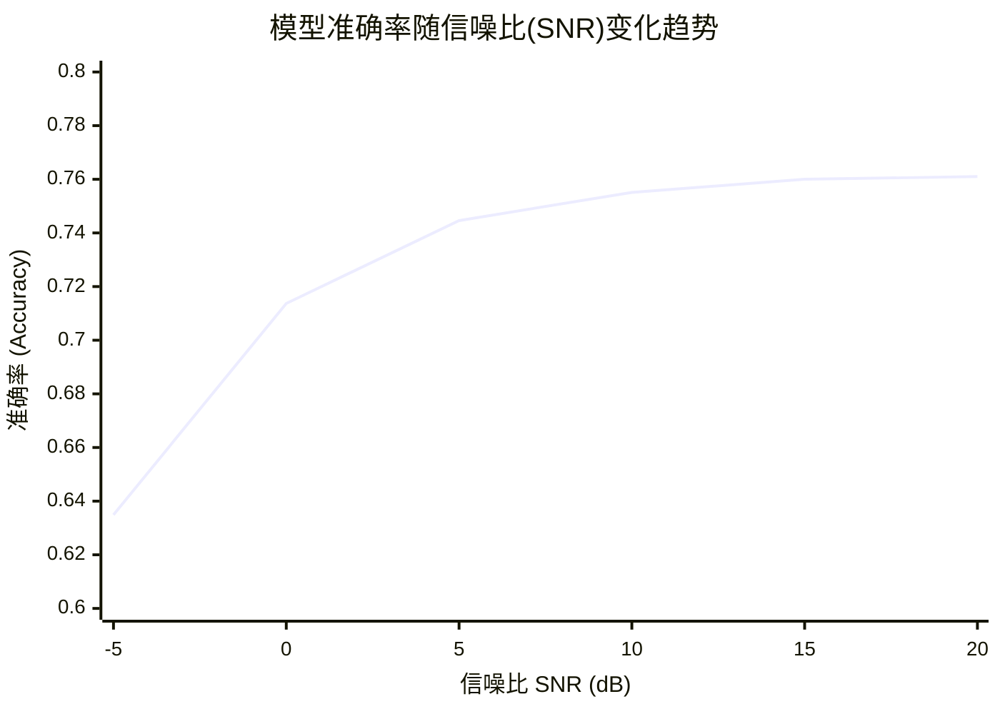
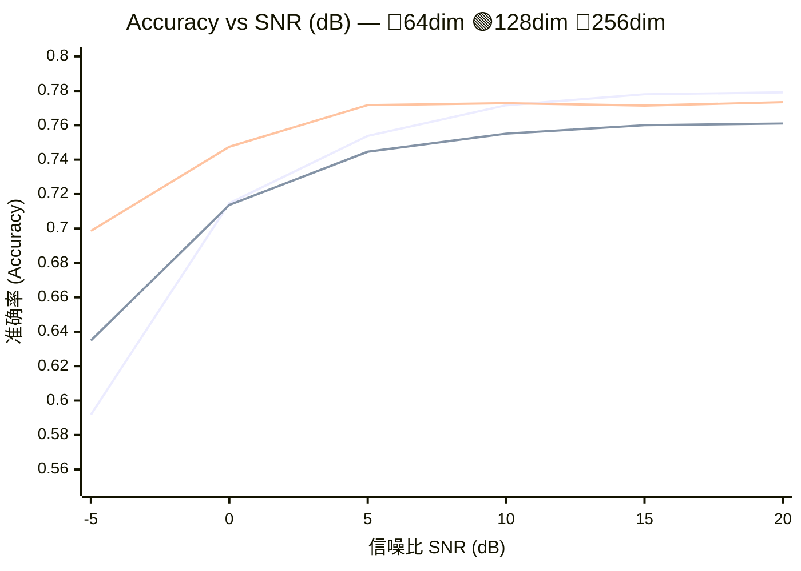

# JEPA SemCom 第1-2周合并笔记

日期：2026-06-09

目标：从零开始，在 8 周内完成一个可复现实验：`CIFAR-10 task-oriented semantic communication under noisy channels`，并把它扩展成 `JEPA-style predictive semantic representation` 的研究雏形。

## 总体路线

前两个月只做三件事：

1. 学会语义通信的最小实验范式：encoder -> channel -> receiver/task head。
2. 学会世界模型和 JEPA 的核心直觉：预测 latent，而不是复原像素。
3. 做出第一个可跑 baseline：在不同 SNR 下比较任务准确率、压缩率和鲁棒性。

推荐第一个研究问题：

`Can JEPA-style predictive representations improve task-oriented semantic communication under noisy channels?`

中文表述：

`JEPA 式预测表征能否提升噪声信道下任务导向语义通信的鲁棒性和传输效率？`

# 第 1 周：通信和语义通信基本概念
## 原计划要求与论文清单

需要掌握：

- Shannon communication model。
- source coding、channel coding、joint source-channel coding。
- AWGN channel、Rayleigh fading、SNR。
- bit-level fidelity vs task-level effectiveness。
- PSNR/SSIM 与 accuracy/mAP/mIoU 的区别。

精读论文：

1. `A Mathematical Theory of Communication`，Shannon, 1948。只读通信模型和噪声信道直觉。
2. `Deep Joint Source-Channel Coding for Wireless Image Transmission`。
3. `Deep Learning Enabled Semantic Communication Systems`。
4. `A Contemporary Survey on Semantic Communications: Theory of Mind, Generative AI, and Deep Joint Source-Channel Coding`。

本周产出：

- 用自己的话写 1 页笔记：什么是语义通信，为什么它和传统压缩不同。
- 跑通或读懂 `semcom_jepa_starter` 的 AWGN channel。

## 详细笔记与实验记录

## 1.Shannon communication mode

Shannon 通信模型关注的是：如何把发送端的信息尽可能可靠地传到接收端。经典链路可以写成：

信息源 → 信源编码 → 信道编码 → 调制/发送 → 信道 → 解调/信道译码 → 信源译码 → 目的端

它的核心目标不是“理解内容”，而是保证接收端恢复出的比特序列尽可能接近发送端。

Shannon 理论里有两个重要思想：

第一，**信源编码**负责去除冗余。例如图像压缩、视频压缩、文本压缩。它关心的是：同样的信息能不能用更少的比特表示。

第二，**信道编码**负责对抗噪声。例如加入纠错码、冗余校验，使信息即使经过噪声信道后也能恢复。

Shannon 的经典结论是：在理想条件下，信源编码和信道编码可以分开设计，这就是 separation theorem。只要传输速率低于信道容量，理论上就可以实现任意低的误码率。

一个常见的信道容量公式是：

$$
C=Blog_2(1+SNR)
$$


其中，C 是信道容量，B 是带宽，SNR 是信噪比。它说明：带宽越大、信噪比越高，理论可传输速率越高。

## 2.Source coding、channel coding、joint source-channel coding

**Source coding，信源编码**
 它的目标是压缩信息，减少冗余。比如 JPEG、H.264、H.265、AV1 都属于信源编码范畴。信源编码可以是无损的，也可以是有损的。无损压缩要求完全恢复原始数据，有损压缩允许一定失真，但希望视觉质量或感知质量尽量高。

**Channel coding，信道编码**
 它的目标是抗干扰、抗噪声、抗丢包。发送端主动加入冗余，接收端利用这些冗余纠错。典型方法包括卷积码、Turbo 码、LDPC 码、Polar 码等。信道编码不是为了压缩，而是为了提高可靠性。

**Joint source-channel coding，联合信源信道编码，JSCC**
 传统通信通常先压缩，再信道编码。而 JSCC 试图把二者合在一起优化。它不一定先生成标准比特流，而是直接把图像、语音或语义特征映射成适合信道传输的表示。深度学习语义通信里常见的 Deep JSCC 就属于这一类。它的优势是：在低 SNR 或信道变化时，性能往往是平滑下降，而不是像传统压缩码流那样一旦关键比特出错就严重崩溃。

## 3.AWGN channel、Rayleigh fading、SNR

**AWGN channel，加性白高斯噪声信道**
 AWGN 是最基础的信道模型：
$$
y = x + n
$$
其中 $x$ 是发送信号，$y$ 是接收信号，$n$ 是高斯噪声。它假设噪声是加性的、白噪声的，并服从高斯分布。AWGN 适合用来分析最基础的噪声干扰。

**Rayleigh fading，瑞利衰落信道**
 Rayleigh fading 更接近无线传播环境。它考虑多径传播：信号从不同路径到达接收端，发生叠加，有时增强，有时抵消。常见模型是：
$$
y = hx + n
$$
其中 $h$ 是随机信道增益。如果没有明显直射路径，信道幅度常用 Rayleigh 分布建模。它比 AWGN 更复杂，因为信号不仅被噪声污染，还会被随机衰落缩放。

**SNR，signal-to-noise ratio，信噪比**
 SNR 表示信号功率和噪声功率的比值：
$$
\mathrm{SNR} = \frac{P_{\text{signal}}}{P_{\text{noise}}}
$$
通常也写成 dB 形式：
$$
\mathrm{SNR_{dB}} = 10\log_{10}(\mathrm{SNR})
$$
SNR 越高，信号越清晰；SNR 越低，噪声越强，通信越困难。

## 4. Bit-level fidelity vs task-level effectiveness

传统通信更关注 **bit-level fidelity，比特级保真度**。也就是说，接收端恢复出来的比特是否和发送端完全一致。例如误码率 BER、块错误率 BLER、包丢失率 PER 都属于这类指标。

但语义通信更关注 **task-level effectiveness，任务级有效性**。它关心的是：接收端是否完成了任务，而不是是否恢复了所有原始比特。

例如，在铁路入侵检测场景中，传统通信希望把完整视频尽量清晰地传回控制中心；语义通信则可能只传“轨道区域、入侵目标类别、位置、运动方向、置信度”等任务相关信息。即使没有恢复原始视频，只要系统能准确判断“有人进入防护区”，任务就是成功的。

所以二者的根本区别是：

**传统通信：传得像不像原始数据。**
**语义通信：传过去的信息能不能支撑任务决策。**

## 5. PSNR/SSIM 与 accuracy/mAP/mIoU 的区别

**PSNR 和 SSIM** 主要用于评价图像或视频重建质量。

PSNR 关注像素误差。PSNR 越高，说明重建图像和原图在像素层面越接近。但它不一定代表视觉感受更好，也不一定代表任务效果更好。

SSIM 关注结构相似性，比如亮度、对比度、结构信息。它比 PSNR 更接近人眼感知，但本质上还是评价“重建图像像不像原图”。

而 **accuracy、mAP、mIoU** 更关注任务效果。

accuracy 常用于分类任务，表示分类正确率。

mAP 常用于目标检测任务，评价模型是否准确检测出目标类别和位置。

mIoU 常用于语义分割任务，评价预测区域和真实区域的重叠程度。

因此：

**PSNR/SSIM 是重建质量指标。**
**accuracy/mAP/mIoU 是任务性能指标。**

在语义通信中，PSNR 高不一定代表任务好。例如图像背景恢复得很清晰，PSNR 可能很高，但入侵目标被压缩模糊了，检测 mAP 反而会下降。语义通信更倾向于保护任务关键语义，而不是平均保护所有像素。


## AWGN channel

```python
def awgn(x: torch.Tensor, snr_db: float) -> torch.Tensor:
    """Add AWGN assuming x has unit average power after normalization."""
    snr_linear = 10 ** (snr_db / 10.0)
    noise_std = (1.0 / snr_linear) ** 0.5
    return x + noise_std * torch.randn_like(x)
```

在通信系统中，信噪比（SNR）的定义为信号功率与噪声功率的比值：
$$
SNR_{linear} = \frac{P_{signal}}{P_{noise}}
$$

根据代码假设，输入信号具有单位平均功率，即 $P_{signal} = 1$，因此：
$$
SNR_{linear} = \frac{1}{P_{noise}}
$$
由于噪声是**加性高斯白噪声，其功率等于其方差**，即 $P_{noise} = \sigma^2$，代入上式可得：
$$
SNR_{linear} = \frac{1}{\sigma^2}
$$

从而可以求出噪声的标准差（均方根）：
$$
\sigma = \frac{1}{\sqrt{SNR_{linear}}}
$$
而在工程应用中，SNR通常以分贝为单位给出（$SNR_{dB}$），它与线性值之间的转换关系为：
$$
SNR_{linear} = 10^{\frac{SNR_{dB}}{10}}
$$


将线性信噪比代入标准差公式，得到最终生成噪声的标准差：
$$
\sigma = \left( \frac{1}{10^{\frac{SNR_{dB}}{10}}} \right)^{0.5} = \frac{1}{\sqrt{10^{\frac{SNR_{dB}}{10}}}}
$$
最后，输出信号为原始信号加上高斯噪声：
$$
y = x + \mathcal{N}(0, \sigma^2) = x + \sigma \cdot \mathcal{N}(0, 1)
$$
这段代码非常简洁，但**非常依赖输入信号的功率确实为1**。如果传入的 `x` 实际功率不是1，那么实际输出的信噪比将不是 `snr_db`。
如果你的输入信号**没有归一化**（即功率 $P_x \neq 1$），需要将噪声标准差修改为：$$\sigma = \sqrt{\frac{P_x}{10^{\frac{SNR_{dB}}{10}}}}$$
对应的代码应修改为：

```python
def awgn_general(x: torch.Tensor, snr_db: float) -> torch.Tensor:  
    # 计算输入信号的平均功率
    sig_power = torch.mean(x ** 2)
    snr_linear = 10 ** (snr_db / 10.0)  
    # 噪声标准差需要乘以信号功率的平方根
    noise_std = (sig_power / snr_linear) ** 0.5  
    return x + noise_std * torch.randn_like(x)
```

## 额外：

对于**功率比**$（P_1/P_2）$，分贝的定义是：
$$
SNR_{dB} = 10⋅log_{10} \frac {P_1}{P_2}
 
$$
最初定义的是“贝尔（Bel）”，公式是 $Bell=log⁡10(P1/P2)$。但在实际使用中发现，1贝尔太大了，比如功率增加10倍才是1贝尔，这不够精细。于是人们把贝尔细分，1贝尔 = 10分贝，这就是为什么前面要乘以一个 10。

# 第 2 周：Task-Oriented Semantic Communication
## 原计划要求与论文清单

需要掌握：

- semantic encoder/decoder。
- task-oriented loss。
- information bottleneck。
- semantic noise。
- rate-accuracy-SNR 曲线。

精读论文：

1. `U-DeepSC: A Universal Deep Semantic Communication System`。
2. `Task-Oriented Multi-User Semantic Communications`。
3. `Task-oriented Explainable Semantic Communications`。
4. `Robust Semantic Communications Against Semantic Noise`。

本周产出：

- 跑通 CIFAR-10 baseline。
- 画出不同 SNR 下的 accuracy 曲线。
- 记录 latent dimension 对 accuracy 的影响。

## 详细笔记与实验记录

下面这几个概念基本就是**深度学习语义通信系统**的核心组件，可以理解为：

**输入数据 → 语义编码 → 信道传输 → 语义解码 → 任务输出**


## 1. Semantic encoder / decoder

**Semantic encoder，语义编码器**，不是简单把图像、语音、文本压缩成比特流，而是从原始数据中提取“对任务有用的语义表示”。

例如铁路入侵检测中，输入是一帧或多帧视频：
$$
x = \text{video frames}
$$
传统编码器关注怎么重建视频，而语义编码器更关注提取：

- 是否有人、动物、机械进入防护区；
- 目标位置；
- 运动方向；
- 轨道区域；
- 风险等级；
- 检测置信度。

可以抽象为：
$$
z = f_{\theta}(x)
$$
其中 $x$ 是原始数据，$f_{\theta}$ 是语义编码器，$z$ 是语义特征。

**Semantic decoder，语义解码器**，负责把接收到的语义表示恢复成任务需要的结果，而不一定恢复原始数据。

例如：
$$
\hat{y} = g_{\phi}(\hat{z})
$$
其中 $\hat{z}$ 是经过信道扰动后的语义特征，$g_{\phi}$ 是语义解码器，$\hat{y}$ 是任务输出。

任务输出可能是：

- 分类结果；
- 检测框；
- 分割掩码；
- 告警结果；
- 控制决策。

所以一句话总结：

**语义编码器负责“提取有用信息”，语义解码器负责“完成任务理解”。**

------

## 2. Task-oriented loss

**Task-oriented loss，面向任务的损失函数**，是语义通信和传统压缩的关键区别之一。

传统压缩常用重建损失，例如：
$$
\mathcal{L}_{rec} = |x - \hat{x}|^2
$$
它希望解码后的图像 $\hat{x}$ 尽可能接近原图 $x$。

但语义通信更关心任务结果是否正确，因此使用任务损失。例如分类任务中使用交叉熵：
$$
\mathcal{L}_{task} = -\sum_i y_i \log \hat{y}_i
$$
检测任务中可能包含分类损失、框回归损失、IoU 损失；分割任务中可能包含交叉熵、Dice loss、IoU loss。

一个典型的语义通信总损失可以写成：
$$
\mathcal{L} = \mathcal{L}_{task} + \lambda \mathcal{L}_{rate} + \beta \mathcal{L}_{robust}
$$
其中：

$\mathcal{L}_{task}$：保证任务准确；
$\mathcal{L}_{rate}$：限制传输码率或特征维度；
$\mathcal{L}_{robust}$：增强对噪声、信道变化的鲁棒性。

它的思想是：

**不是让接收端“看起来像原图”，而是让接收端“判断得正确”。**

------

## 3. Information bottleneck

**Information bottleneck，信息瓶颈**，可以理解为：
在输入 $X$ 和任务标签 $Y$  之间，学习一个中间表示 $Z$，让 $Z$ 尽量压缩 $X$ 中无关信息，同时保留对 $Y$ 有用的信息。

经典目标可以写成：
$$
\min I(X;Z)-\beta I(Z;Y)
$$


它的含义是：

- $I(X;Z)$：表示 $Z$ 从原始输入 $X$ 中保留了多少信息。希望它小一些，说明表示更压缩；
- $I(Z;Y)$：表示 $Z$ 对任务标签 $Y$ 有多少帮助。希望它大一些，说明语义表示对任务有效；
- $\beta$：控制“压缩”和“任务性能”的平衡。

放到语义通信里，信息瓶颈非常自然：

原始视频里有大量无关内容，比如天空、空轨道、背景建筑、静态设施。语义通信不需要全部传输，而是要通过编码器形成一个紧凑的 (Z)，只保留和入侵检测有关的信息。

所以信息瓶颈的本质是：

**少传无关信息，多保留任务语义。**

------

## 4. Semantic noise

**Semantic noise，语义噪声**，不是传统意义上的物理噪声，而是会干扰语义理解的因素。

传统信道噪声关注的是：
$$
y = x + n
$$
其中 $n$ 是 AWGN 这类物理噪声。

而语义噪声关注的是：即使信号传输成功，接收端仍然可能理解错误。

例如：

### 图像/视频任务中的语义噪声

- 光照变化；
- 雨雪雾天气；
- 遮挡；
- 目标太小；
- 背景和目标相似；
- 摄像头抖动；
- 低分辨率；
- 训练数据和测试场景分布不同。

### 文本任务中的语义噪声

- 歧义；
- 上下文缺失；
- 同义表达；
- 错别字；
- 语言风格变化。

### 通信系统中的语义噪声

- 语义特征被信道扰动；
- 编码器提取了错误语义；
- 解码器误解语义特征；
- 任务模型在新场景下泛化失败。

所以语义噪声可以理解为：

**凡是导致“语义理解错误”的因素，都可以看作语义噪声。**

它比物理噪声更上层。AWGN、Rayleigh fading 会导致信号失真；而 semantic noise 会导致“任务判断错误”。

------

## 5. Rate-accuracy-SNR 曲线

**Rate-accuracy-SNR 曲线**用于分析语义通信系统在不同传输条件下的任务表现。

它涉及三个核心变量：

### Rate：传输率 / 码率

表示传输了多少信息。可以是：

- bit per pixel，bpp；
- bit per symbol；
- feature dimension；
- channel uses；
- compression ratio。

Rate 越高，通常传的信息越多，但带宽占用也越大。

### Accuracy：任务准确率

表示任务完成效果。根据任务不同，可以是：

- 分类 accuracy；
- 检测 mAP；
- 分割 mIoU；
- 事件识别 F1-score；
- 控制成功率。

Accuracy 越高，说明语义通信越有效。

### SNR：信噪比

表示信道质量。SNR 越高，信道越好；SNR 越低，信道越差。

------

## 6. 怎么理解这条曲线？

可以把它看成语义通信系统的性能地图。

### 固定 SNR，看 Rate-Accuracy

如果信道质量不变，随着 Rate 增大，系统可以传输更多语义信息，accuracy 通常会上升。

但它不会无限上升，因为任务性能会达到饱和。

也就是说：

**前期多传一点信息，准确率提升明显；后期再增加码率，收益变小。**

------

### 固定 Rate，看 SNR-Accuracy

如果传输码率固定，SNR 越高，信道干扰越小，接收端语义特征越可靠，accuracy 通常越高。

但如果语义编码本身很鲁棒，那么在低 SNR 下 accuracy 也可能保持较好。

这也是语义通信的重要目标：

**在低 SNR 下，不一定保证图像重建清晰，但要尽量保证任务结果正确。**

------

### 同时看 Rate、Accuracy、SNR

完整地看，rate-accuracy-SNR 其实是一个三维关系：
$$
Accuracy = F(Rate, SNR)
$$
它回答的问题是：

在某个信道质量下，传多少语义信息才能达到目标任务性能？

例如：

- SNR = 20 dB 时，只需要低码率就能达到较高 mAP；
- SNR = 5 dB 时，需要更高码率或更强鲁棒编码；
- Rate 很低时，即使 SNR 很高，accuracy 也可能受限，因为语义信息本身不够；
- SNR 很低时，即使 Rate 较高，accuracy 也可能下降，因为信道破坏严重。

------

## 7. 总结成一张表

| 概念                   | 关注点                       | 在语义通信中的作用                         |
| ---------------------- | ---------------------------- | ------------------------------------------ |
| Semantic encoder       | 提取任务相关语义             | 把原始数据变成紧凑语义表示                 |
| Semantic decoder       | 理解语义并完成任务           | 输出分类、检测、分割或决策结果             |
| Task-oriented loss     | 任务是否做对                 | 用 accuracy、mAP、mIoU 等目标训练系统      |
| Information bottleneck | 压缩无关信息，保留有用信息   | 减少背景冗余，只传任务关键语义             |
| Semantic noise         | 语义理解干扰                 | 描述导致任务误判的上层噪声                 |
| Rate-accuracy-SNR      | 码率、任务性能、信道质量关系 | 衡量语义通信系统在不同带宽和信道下是否有效 |

## 8.产出

- 跑通 CIFAR-10 baseline。✅
- 画出不同 SNR 下的 accuracy 曲线。✅❌
- 记录 latent dimension 对 accuracy 的影响。✅❌

日志信息

```
epoch=20 val_loss=0.7086 val_acc=0.7563 snr_db=10.0 best_acc=0.7565
128dim下的

snr_db= -5.0 loss=1.1073 accuracy=0.6349
snr_db=  0.0 loss=0.8076 accuracy=0.7137
snr_db=  5.0 loss=0.7222 accuracy=0.7446
snr_db= 10.0 loss=0.6929 accuracy=0.7551
snr_db= 15.0 loss=0.6825 accuracy=0.7600
snr_db= 20.0 loss=0.6803 accuracy=0.7610
```





**排除随机性后，dim越大，在低信噪比的场景下抗干扰越强。**

## 阶段梳理

第 1-2 周的目标是完成语义通信最小闭环：先理解 Shannon 通信、JSCC、AWGN/SNR 和任务级指标，再跑通 CIFAR-10 baseline，记录不同 SNR 和 latent dimension 下的 accuracy，为后续 JEPA/世界模型实验提供可复现基线。
