# JEPA SemCom 第3-4周合并笔记

> 本文件由两份 Markdown 合并拆分而成，保留原始 8 周计划的论文清单与详细笔记内容。

# 第 3 周：世界模型基础

## 原计划要求与论文清单

需要掌握：

- latent dynamics。
- imagination rollout。
- model-based RL。
- observation model、reward model、transition model。
- prediction error 和 uncertainty。

精读论文：

1. `Recurrent World Models Facilitate Policy Evolution`。
2. `Learning Latent Dynamics for Planning from Pixels (PlaNet)`。
3. `Dream to Control: Learning Behaviors by Latent Imagination (Dreamer)`。
4. `DreamerV3: Mastering Diverse Control Tasks through World Models`。

本周产出：

- 画一张图解释 PlaNet/Dreamer 的 latent world model。
- 思考：如果 receiver 已经有 world model，哪些内容不需要传？

## 详细笔记与实验记录

## 1.latent dynamics。隐空间动力学

传统强化学习直接面对的是高维观测，例如图像：
$$
o_t \in \mathbb{R}^{H \times W \times C}
$$
但图像里有大量无关信息，比如背景、纹理、光照。世界模型的核心思想是先把观测压缩成低维隐变量：
$$
z_t = \text{Encoder}(o_t)
$$
然后不在像素空间预测未来，而是在 latent 空间预测：
$$
p(z_{t+1} \mid z_t, a_t)
$$
这就是 **latent dynamics**。它回答的是：

> 如果当前世界状态是 $z_t$，我执行动作 $a_t$，下一步世界大概会变成什么？

PlaNet 的关键贡献就是学习一个带有**确定性状态**和**随机状态**的 recurrent state-space model，也就是 RSSM，用于从图像中学习可规划的 latent dynamics。论文强调 PlaNet 是一个从图像学习环境动力学、并在 latent 空间快速规划的纯 model-based agent。

## 2.imagination rollout。想象轨迹展开

有了世界模型以后，智能体不一定每次都要和真实环境交互。它可以在模型里面“脑补未来”：
$$
z_t \rightarrow z_{t+1} \rightarrow z_{t+2} \rightarrow \cdots \rightarrow z_{t+H}
$$
同时预测每一步奖励：
$$
\hat r_{t+1}, \hat r_{t+2}, \cdots, \hat r_{t+H}
$$
这就是 **imagination rollout**，也可以理解成：

> 在脑中的虚拟世界里尝试动作序列，看哪条未来轨迹更好。

PlaNet 用 imagined trajectories 做 **CEM planning**，每一步重新搜索动作序列；Dreamer 则更进一步，直接在 imagined latent trajectories 上训练 actor 和 value model。Dreamer 的论文摘要明确说，它通过 compact latent space 中的 imagined trajectories 学习长时域行为，并把 value gradients 反向传播回 imagined trajectories。

## 3. model-based RL。

强化学习可以粗略分为两类：

| 类型           | 核心思想                                 | 典型方法                      |
| -------------- | ---------------------------------------- | ----------------------------- |
| model-free RL  | 不显式学习环境模型，直接学策略或价值函数 | DQN、PPO、SAC                 |
| model-based RL | 先学环境模型，再用模型规划或训练策略     | World Models、PlaNet、Dreamer |

model-based RL 的优势是**样本效率高**。因为一次真实交互得到的数据，可以反复用于训练世界模型；而世界模型又可以生成大量 imagined rollouts 辅助决策。PlaNet 官方项目页强调，它通过从图像学习 dynamics 并在 latent space 中规划，相比强 model-free 方法可以显著减少环境交互。

你可以这样理解：

> model-free RL 是“我亲自试很多次，然后总结经验”；
>  model-based RL 是“我先学会世界怎么运转，然后在脑子里模拟很多次”。

## 4.observation model、reward model、transition model。

一个标准 latent world model 通常包含三个核心模型：

1）transition model：状态转移模型
$$
p(z_{t+1} \mid z_t, a_t)
$$
作用：预测执行动作后 latent state 如何变化。

这是世界模型的核心。没有 transition model，就不能想象未来。

2）observation model：观测模型 / 解码器
$$
p(o_t \mid z_t)
$$
作用：从 latent state 重建图像观测。

注意：在 PlaNet / Dreamer 中，observation model 主要用于训练 world model，让 latent state 保留足够的环境信息；但在规划或策略学习时，不一定需要真的解码成图像。PlaNet 项目页也指出，规划时会从当前 hidden state 预测未来奖励，昂贵的 image decoder 在 planning 阶段并不需要使用。

3）reward model：奖励模型
$$
p(r_t \mid z_t)
$$
作用：预测当前 latent state 对应的奖励。

这非常关键。因为智能体想象未来不是为了生成漂亮图片，而是为了判断：

> 这条未来轨迹的累计奖励高不高？

因此，reward model 决定了 imagined rollout 是否对决策有用。

## 5.prediction error 和 uncertainty

世界模型不是完美的。它预测未来时会犯错，这个错误就是 **prediction error**。

常见 prediction error 包括：
$$
\| o_t - \hat{o}_t \|
$$
但更重要的是 **multi-step prediction error**。一步预测准，不代表连续预测 20 步还准。PlaNet 提出 latent overshooting，就是为了改善多步 latent 预测能力。

uncertainty 可以理解成：

> 模型对未来到底有多不确定？

它主要有两类：

| 类型                  | 含义               | 例子                       |
| --------------------- | ------------------ | -------------------------- |
| aleatoric uncertainty | 环境本身随机       | 同一个动作可能导致多个未来 |
| epistemic uncertainty | 模型没见过、不知道 | 进入训练数据外的新场景     |

PlaNet / Dreamer 这类 RSSM 通过 stochastic latent state 表达一部分不确定性，但如果要更严格地估计 epistemic uncertainty，通常还需要 ensemble、Bayesian model、dropout 或 disagreement model 等方法。

精读论文：

1. `Recurrent World Models Facilitate Policy Evolution`。

这篇是世界模型路线的经典起点。它把智能体拆成三个部分：
$$
\text{VAE} + \text{RNN/MDN-RNN} + \text{Controller}
$$
具体来说：

| 模块       | 作用                                           |
| ---------- | ---------------------------------------------- |
| VAE        | 把高维图像压缩成 latent vector                 |
| MDN-RNN    | 在 latent 空间预测下一个状态                   |
| Controller | 根据 latent state 和 RNN hidden state 输出动作 |

这篇论文的核心思想是：

> 先无监督地学一个可预测环境变化的世界模型，再用一个很小的 controller 在这个内部模型中学习控制。

NeurIPS 页面摘要指出，该方法使用生成式循环神经网络以无监督方式建模强化学习环境，把 world model 提取出的特征输入到简单策略中，并且还可以完全在内部生成环境中训练 agent，再迁移回真实环境。

> World Models 证明了“先学世界，再学控制”是可行的，但它的 representation、dynamics、policy 基本是分阶段训练的，后续 PlaNet / Dreamer 会让这个框架更系统、更强化学习化。

2.`Learning Latent Dynamics for Planning from Pixels (PlaNet)`。

PlaNet 的全称是 **Deep Planning Network**。它的核心贡献是：

> 从像素观测中学习 latent dynamics，然后直接在 latent space 中做 online planning。

PlaNet 不直接训练一个 policy network，而是在每个环境步使用 CEM 搜索未来动作序列。论文明确说，PlaNet 是纯 model-based agent，从图像学习环境动力学，并在 latent space 中快速 online planning。

PlaNet 的关键结构是 RSSM：
$$
h_t = f(h_{t-1}, z_{t-1}, a_{t-1})
$$
其中：

| 状态  | 含义                                              |
| ----- | ------------------------------------------------- |
| $h_t$ | deterministic hidden state，记忆历史              |
| $z_t$ | stochastic latent state，表达不确定性和多模态未来 |

PlaNet 训练时包含：

| 模型              | 作用                        |
| ----------------- | --------------------------- |
| encoder           | 从图像推断 latent posterior |
| transition model  | 预测 latent prior           |
| observation model | 重建图像                    |
| reward model      | 预测奖励                    |

PlaNet 的规划过程是：

1. 用 encoder 把历史观测变成当前 latent state；
2. 在 latent space 中采样多组动作序列；
3. 用 transition model 展开未来；
4. 用 reward model 预测累计奖励；
5. 选择累计奖励最高的动作序列；
6. 只执行第一个动作，下一步重新规划。

> PlaNet 的重点不是学策略，而是学一个足够好的 latent dynamics，然后每一步在这个 latent world model 里搜索最优动作。

3.`Dream to Control: Learning Behaviors by Latent Imagination (Dreamer)`。

Dreamer 是 PlaNet 的重要升级。它保留 latent world model，但不再每一步都用 CEM 做 online planning，而是学习：

| 模型        | 作用                                   |
| ----------- | -------------------------------------- |
| world model | 预测 latent dynamics、reward、discount |
| actor model | 在 latent state 上输出动作             |
| value model | 估计 latent state 的长期价值           |

Dreamer 的核心思想是：

> 不用真实环境轨迹直接训练 actor，而是在 world model 想象出来的 latent trajectories 上训练 actor 和 critic。

Dreamer 官方代码说明中也写到，它先从经验中学习 world model，再在 compact latent space 中学习 action model 和 value model；value model 优化 imagined trajectories 的 Bellman consistency，action model 通过 imagined trajectories 反传 value gradients。

这就解决了 PlaNet 的一个问题：

| PlaNet                     | Dreamer                                   |
| -------------------------- | ----------------------------------------- |
| 每一步在线 CEM 搜索动作    | 训练一个 actor，执行时直接输出动作        |
| planning 成本较高          | 推理更快                                  |
| 不显式学习 policy          | 学 actor 和 value                         |
| 主要是 planning from model | 主要是 learning behavior from imagination |

**一句话总结：**

> Dreamer 把“在世界模型中规划”变成了“在世界模型中训练策略”，因此更接近现代可扩展 model-based RL。

4.`DreamerV3: Mastering Diverse Control Tasks through World Models`。

DreamerV3 的目标是做一个更通用、更稳健的 world-model RL 算法。

它的关键不只是“模型结构更强”，而是让算法在很多任务上使用同一套超参数也能稳定工作。DreamerV3 的 arXiv 摘要称，它在超过 150 个多样任务上用单一配置超过专门方法，并通过 normalization、balancing、transformations 等稳定化技术跨领域学习；项目页也强调了固定超参数和广泛任务泛化能力。

DreamerV3 的代码仓库说明提到，它从经验中学习 world model，并使用 imagined trajectories 训练 actor-critic policy；world model 会把感知输入编码成 categorical representations，并在给定动作后预测未来表示和奖励。

需要注意：你列出的题名 **“DreamerV3: Mastering Diverse Control Tasks through World Models”** 更接近 2025 年 Nature 版本标题；arXiv 版本常见标题是 **“Mastering Diverse Domains through World Models”**。Nature 页面和项目页使用的是 “Mastering Diverse Control Tasks through World Models”。

> DreamerV3 的重点是把 Dreamer 路线从“某类连续控制任务有效”推进到“多领域、固定配置、可扩展”的通用世界模型强化学习框架。

本周产出：

- 画一张图解释 PlaNet/Dreamer 的 latent world model。

  https://chatgpt.com/s/m_6a2a2727f6c481919683ad20ffb4c26d

- 思考：如果 receiver 已经有 world model，哪些内容不需要传？

这个问题非常关键，和你的“世界模型 + 语义通信”研究方向直接相关。

假设发送端是 camera / sensor / edge device，接收端是 receiver / control center。如果 receiver 已经拥有一个足够好的 world model，那么通信不一定需要传完整观测，而只需要传 **world model 无法可靠推断的部分**。

### 5.1 不需要传的内容

1）可预测的背景

例如铁路沿线场景中：

- 天空；
- 固定轨道；
- 站台边缘；
- 电线杆；
- 静态建筑；
- 长时间不变的背景纹理。

如果 receiver 的 world model 已经知道这些静态结构，就不需要每一帧重复传。

对应语义通信表达：

> 不传 full pixels，只传 background residual 或 scene change。

------

2）连续帧中的冗余时间信息

视频帧之间高度相关。假如 receiver 已有 latent dynamics：
$$
\hat z_{t+1} = f_\theta(z_t, a_t)
$$
那么它可以自己预测下一时刻的大部分状态。因此发送端不必传每一帧完整图像，只需要传：
$$
\Delta z_t = z_t - \hat z_t
$$
也就是预测残差。

可以理解成：

> receiver 自己能想象出来的未来，不需要发送端重复传。

------

3）任务无关细节

如果任务是入侵检测，那么很多像素细节并不重要：

- 天空颜色；
- 轨道石子纹理；
- 树叶轻微摆动；
- 光照变化；
- 远处建筑细节。

这些内容对“是否有人/动物/施工机械进入防护区”没有直接帮助，可以不传。

应该传的是：

- 目标类别；
- 目标位置；
- 目标速度；
- 目标轨迹；
- 与轨道/防护区的空间关系；
- 置信度；
- 异常程度。

------

4）receiver 已经掌握的动力学规律

如果 receiver 的 world model 已经知道某些运动规律，就不需要传完整运动过程。

例如：

- 列车沿轨道运动；
- 行人速度范围；
- 摄像机视角固定；
- 目标短时间内位置连续；
- 无人机/机器人 obey dynamics constraints。

发送端只需要传关键状态更新：
$$
z_t, \Delta z_t, \text{event}, \text{uncertainty}
$$
而不是传完整图像序列。

------

5）低不确定性的预测区域

如果 world model 对某个区域预测很确定，例如“空轨道仍然是空轨道”，则不需要高码率传输。

但如果出现：

- 新目标；
- 遮挡；
- 突然运动；
- 低光照；
- 模型预测和观测不一致；
- uncertainty 升高；

则需要提高传输量。

这可以形成一种 **uncertainty-aware semantic transmission**：
$$
\text{Transmit}(x_t) =
\begin{cases}
\text{low rate}, & \text{uncertainty low} \\
\text{high rate}, & \text{uncertainty high}
\end{cases}
$$

------

### 5.2 必须传的内容

如果 receiver 有 world model，也不是所有东西都能省掉。必须传的是：

| 必须传的内容                     | 原因                                   |
| -------------------------------- | -------------------------------------- |
| 初始状态 / 当前 latent state     | receiver 需要知道现在世界处于哪个状态  |
| prediction residual              | 修正 receiver 自己预测错的地方         |
| novel object / unexpected event  | 世界模型无法凭空知道新事件             |
| task-relevant semantics          | 决策任务需要的核心信息                 |
| uncertainty / confidence         | 告诉 receiver 哪些预测可靠，哪些不可靠 |
| goal / reward / task instruction | 不同任务关注的语义不同                 |
| model update signal              | 长期部署时需要适应新环境               |

因此，最理想的语义通信形式不是：
$$
\text{send full image}
$$
而是：
$$
\text{send } (z_t, \Delta z_t, \text{event}, \text{uncertainty}, \text{task semantics})
$$

世界模型的核心思想是让智能体在内部学习一个可预测环境变化的模型。它不直接在高维图像空间中进行控制，而是先把观测编码为紧凑的 latent state，再通过 transition model 预测未来 latent state，并通过 reward model 评估未来轨迹的价值。PlaNet 代表了“学习 latent dynamics 并在 latent space 中规划”的路线，它使用 RSSM 建模部分可观测环境，并通过 CEM 在想象轨迹中选择动作。Dreamer 在 PlaNet 的基础上进一步将在线规划转化为 latent imagination 中的 actor-critic 学习，使策略能够直接从 imagined rollouts 中获得训练信号。DreamerV3 则进一步提升了算法的稳定性和通用性，使 world-model RL 能够在多种任务上使用统一配置进行学习。

从语义通信角度看，如果接收端已经拥有 world model，那么发送端就不必传输完整观测，而应优先传输接收端无法准确预测的部分，例如当前 latent state、预测残差、新出现的目标、任务相关语义以及不确定性信息。换言之，world model 可以作为接收端的“先验知识”和“预测器”，通信系统只需要传输对任务决策有增量价值的信息。这为“世界模型驱动的语义通信”提供了一个重要研究思路：由 full observation transmission 转向 latent state / residual / event / uncertainty transmission。

# 第 4 周：JEPA 和预测式表征

## 原计划要求与论文清单

需要掌握：

- self-supervised representation learning。
- masked prediction。
- pixel reconstruction vs feature prediction。
- joint embedding predictive architecture。
- collapse prevention。

精读论文：

1. `Self-Supervised Learning from Images with a Joint-Embedding Predictive Architecture`。
2. `Revisiting Feature Prediction for Learning Visual Representations from Video`。
3. `V-JEPA 2: Self-Supervised Video Models Enable Understanding, Prediction and Planning`。
4. `Point-JEPA` 或 `A-JEPA`，任选一个扩展方向。

本周产出：

- 理解 I-JEPA/V-JEPA 的 encoder、context、target、predictor。
- 写一页笔记：为什么 JEPA 比 pixel reconstruction 更适合语义通信？

## 详细笔记与实验记录

这一周的核心主线是：

> 不再重建像素，而是在表征空间中预测缺失部分。
>  也就是从 **pixel reconstruction** 转向 **feature prediction / semantic prediction**。

这和语义通信非常相关，因为语义通信真正关心的不是“像素是否还原”，而是“任务相关语义是否保留”。

### 1.1 self-supervised representation learning：自监督表征学习

自监督学习的目标是：

> 不依赖人工标签，从数据本身构造训练信号，让模型学到有用表征。

例如图像中，可以遮住一部分，让模型预测被遮住的部分；视频中，可以根据过去帧预测未来帧或未来特征；点云中，可以根据部分点云预测被遮挡区域的表征。

传统监督学习是：
$$
(x, y) \rightarrow \text{model learns } p(y|x)
$$
自监督学习是：
$$
x \rightarrow \text{construct pseudo task} \rightarrow \text{learn representation}
$$
在 JEPA 里，自监督任务不是“还原原始像素”，而是：
$$
\text{context representation} \rightarrow \text{target representation}
$$
也就是说，模型学的是**语义层面的可预测结构**。

### 1.2 masked prediction：掩码预测

masked prediction 是自监督学习中最常见的任务设计。

基本做法是：

1. 输入一张图像或一段视频；
2. 随机遮住一部分 patch / tubelet；
3. 模型只能看到 context；
4. 要求模型预测被遮住 target 的内容或表征。

在 MAE 这类方法中，模型通常预测像素：
$$
\hat{x}_{target} = f(x_{context})
$$
而在 JEPA 中，模型预测 target 的 latent feature：
$$
\hat{z}_{target} = f(z_{context})
$$
这就是 JEPA 和 pixel reconstruction 的根本区别。

### 1.3 pixel reconstruction vs feature prediction

这部分非常重要，建议你单独做笔记。

| 对比项         | Pixel Reconstruction       | Feature Prediction / JEPA                |
| -------------- | -------------------------- | ---------------------------------------- |
| 预测对象       | 原始像素                   | latent feature / semantic representation |
| 关注重点       | 纹理、颜色、边缘、局部细节 | 物体、结构、关系、运动、语义             |
| 典型方法       | MAE、autoencoder           | I-JEPA、V-JEPA                           |
| 优点           | 训练目标直观，容易实现     | 更接近语义理解和任务决策                 |
| 缺点           | 容易浪费容量在低层细节     | target feature 设计和防坍塌更关键        |
| 与语义通信关系 | 更像传统图像压缩           | 更像任务导向语义压缩                     |

I-JEPA 论文明确提出，它是一个**非生成式**自监督方法，不依赖手工数据增强，其核心是从图像中的 context block 预测同一图像中 target block 的表示，而不是预测像素。论文还强调 I-JEPA 学到的是更语义化的图像表征，并在效率上优于一些重建式方法。

所以你可以这样理解：

> Pixel reconstruction 学的是“这块图像长什么样”；
>  JEPA 学的是“这块区域在语义上应该是什么”。

### 1.4 joint embedding predictive architecture：联合嵌入预测架构

JEPA 的核心组件有四个：

| 组件            | 作用                                                   |
| --------------- | ------------------------------------------------------ |
| context encoder | 编码可见区域，得到 context representation              |
| target encoder  | 编码目标区域，得到 target representation               |
| predictor       | 根据 context representation 预测 target representation |
| loss            | 约束预测表征接近真实 target 表征                       |

基本公式可以写成：
$$
z_c = f_\theta(x_c)
$$
其中：

- $x_c$：context 区域；
- $x_t$：target 区域；
- $f_\theta$：context encoder； 
- $f_{\bar{\theta}}$：target encoder，通常由 EMA 更新；
- $g_\phi$：predictor；
- $m_t$：target mask 或位置信息；
- $\hat{z}_t$：预测出来的 target feature；
- $z_t$：target encoder 得到的真实 target feature。

I-JEPA 官方代码库https://github.com/facebookresearch/ijepa?utm_source=chatgpt.com也说明，I-JEPA 的高层思想就是从同一图像中一部分区域的表示预测另一部分区域的表示，并由此学习语义图像特征。

## 论文

**`Self-Supervised Learning from Images with a Joint-Embedding Predictive Architecture`。‘**

给定图像中的可见 context block，预测同一图像中被遮挡 target block 的表征，而不是重建 target block 的像素。
I-JEPA 把 masked image modeling 从“重建像素”改成“预测语义表征”，因此更适合学习抽象、稳定、任务相关的视觉表示。

**`Revisiting Feature Prediction for Learning Visual Representations from Video`。**

这篇可以理解成 I-JEPA 从图像扩展到视频。

V-JEPA 的核心是：

> 在视频中做 feature prediction，用可见时空上下文预测被遮挡时空区域的 latent representation。

这篇论文提出，V-JEPA 只使用 feature prediction 作为无监督学习目标，不使用预训练图像编码器、文本、负样本、重建或其他监督信号。模型在 200 万个公开视频上训练，并在多个图像和视频任务上评估。

和 I-JEPA 相比，V-JEPA 多了一个关键维度：**时间**。

| I-JEPA                        | V-JEPA                             |
| ----------------------------- | ---------------------------------- |
| 图像表征学习                  | 视频表征学习                       |
| 预测空间区域 feature          | 预测时空 tube feature              |
| 学习 object / scene semantics | 学习 appearance + motion semantics |
| 关注图像语义                  | 关注视频动态语义                   |

V-JEPA 说明 feature prediction 可以作为视频自监督学习的独立目标，而且不需要文本、负样本或像素重建，也能学到兼顾外观和运动的视觉表征。

**`V-JEPA 2: Self-Supervised Video Models Enable Understanding, Prediction and Planning`。**

V-JEPA 2 是这一周最值得关注的论文，因为它把 JEPA 从“表征学习”进一步推向了“理解、预测和规划”。

论文提出先在大规模视频和图像数据上预训练 action-free V-JEPA 2，然后用少量机器人交互数据后训练 action-conditioned world model，也就是 V-JEPA 2-AC。根据论文摘要，V-JEPA 2 使用超过 100 万小时的互联网视频进行预训练，并用少于 62 小时的 DROID 机器人视频进行后训练，最终在 Franka 机械臂上实现 zero-shot pick-and-place，不需要目标环境数据采集、任务特定训练或奖励。

官方仓库也说明，V-JEPA 2 是一种利用互联网规模视频数据训练视频编码器的自监督方法；V-JEPA 2-AC 是从 V-JEPA 2 后训练得到的 latent action-conditioned world model，可在没有环境特定数据或任务特定训练的情况下解决机器人操作任务。

这篇论文对你“世界模型 + 语义通信”的方向特别重要，因为它说明：

> JEPA 不只是表征学习方法，也可以成为 latent world model 的视觉基础。

> V-JEPA 2 把 JEPA 从视觉表征学习推进到物理世界预测和机器人规划，为“基于预测式表征的世界模型”提供了非常直接的研究入口。

`Point-JEPA` 或 `A-JEPA`，任选一个扩展方向。

这里我建议你选 **Point-JEPA**，因为它比 A-JEPA 更适合扩展到多模态感知、三维空间建模、无人机/机器人/铁路场景。

Point-JEPA 是 JEPA 在点云数据上的扩展。它面向 point cloud self-supervised learning，目标是在不依赖输入空间重建或额外模态的情况下学习点云表征。论文摘要提到，Point-JEPA 专门为点云数据设计 joint embedding predictive architecture，用于解决点云自监督方法中预训练耗时、依赖输入空间重建或需要额外模态的问题。

官方代码库也说明，Point-JEPA 利用点云 patch embedding 的空间邻近关系进行 context 和 target 选择，从而提升效率。

**为什么推荐 Point-JEPA？**

因为你的研究可能涉及：

- 铁路沿线视频；
- 无人机感知；
- 机器人/世界模型；
- 多源观测；
- 语义通信中的 compact representation。

点云天然适合表示三维空间结构。如果未来你要做“视觉 + 点云 + 语义通信”，Point-JEPA 可以作为一个很好的扩展方向。

**一句话总结：**

> Point-JEPA 把 JEPA 的“在表征空间预测缺失部分”思想扩展到三维点云，适合研究空间结构语义和多模态语义通信。

## 理解

## 3. I-JEPA / V-JEPA 的结构理解

### 3.1 四个核心模块

| 模块      | 在 I-JEPA 中        | 在 V-JEPA 中                        | 作用                        |
| --------- | ------------------- | ----------------------------------- | --------------------------- |
| encoder   | 编码图像 patch      | 编码视频 tubelet                    | 提取 context representation |
| context   | 图像可见区域        | 视频可见时空区域                    | 提供预测依据                |
| target    | 图像被遮挡区域      | 视频被遮挡时空区域                  | 作为预测目标                |
| predictor | 预测 target feature | 预测 target spatio-temporal feature | 学习语义/动态关系           |

更简单地说：

> Encoder 负责“看见”；
>  Context 是“已知信息”；
>  Target 是“被预测的未知部分”；
>  Predictor 负责“根据已知推断未知”。

------

### 3.2 Markdown / Mermaid 流程图

这张图可以直接复制到你的 Chirpy/Jekyll Markdown 文章里。如果你的 Chirpy 没启用 Mermaid，可以先作为代码块保存，或者后续我再帮你转成 SVG/PNG 放到 `assets/img/posts/` 里。

```mermaid
flowchart LR
    %% =============== 样式 ===============
    classDef input fill:#EAF3FF,stroke:#2B6CB0,stroke-width:1.5px,color:#0B2545;
    classDef context fill:#F4ECFF,stroke:#6B46C1,stroke-width:1.5px,color:#2D1B69;
    classDef target fill:#FFF7ED,stroke:#DD6B20,stroke-width:1.5px,color:#7B341E;
    classDef pred fill:#ECFDF5,stroke:#2F855A,stroke-width:1.5px,color:#064E3B;
    classDef loss fill:#FEF2F2,stroke:#C53030,stroke-width:1.5px,color:#742A2A;
    classDef note fill:#F7FAFC,stroke:#718096,stroke-width:1px,color:#2D3748;

    %% =============== 输入 ===============
    A["输入数据<br/>I-JEPA: Image<br/>V-JEPA: Video"]:::input

    B["Mask / Block Sampling<br/>划分 context 与 target"]:::input

    A --> B

    %% =============== Context 分支 ===============
    subgraph CBranch["Context Branch：可见区域"]
        direction TB
        C1["Context<br/>可见 patch / tubelet"]:::context
        C2["Context Encoder<br/>f_θ"]:::context
        C3["Context Representation<br/>z_c"]:::context
        C1 --> C2 --> C3
    end

    %% =============== Target 分支 ===============
    subgraph TBranch["Target Branch：被预测区域"]
        direction TB
        T1["Target<br/>被遮挡 patch / tubelet"]:::target
        T2["Target Encoder<br/>f_θ̄ / EMA"]:::target
        T3["Target Representation<br/>z_t<br/>停止梯度 / stop-grad"]:::target
        T1 --> T2 --> T3
    end

    B --> C1
    B --> T1

    %% =============== Predictor ===============
    C3 --> P["Predictor<br/>g_φ(z_c, target position)<br/><br/>根据 context 预测 target feature"]:::pred

    P --> ZHAT["Predicted Target Representation<br/>ẑ_t"]:::pred

    %% =============== Loss ===============
    ZHAT --> L["Feature Prediction Loss<br/>让 ẑ_t 接近 z_t<br/><br/>不是重建像素，而是预测语义表征"]:::loss
    T3 --> L

    %% =============== 输出 ===============
    L --> O["学到语义表征<br/>object / scene / motion / spatial structure"]:::note

    %% =============== 底部总结 ===============
    S["核心区别：<br/>MAE / Autoencoder 预测 pixel；<br/>I-JEPA / V-JEPA 预测 feature。<br/><br/>因此 JEPA 更关注高级语义结构，而不是低层纹理细节。"]:::note

    O --> S
```

------

## 4. 为什么 JEPA 比 pixel reconstruction 更适合语义通信？

这里是你本周的一页笔记，可以直接放到 Markdown 里。

### 为什么 JEPA 比 pixel reconstruction 更适合语义通信？

语义通信的目标不是尽可能完整地恢复原始信号，而是在有限带宽、噪声信道和任务约束下，优先传输对接收端理解和决策有用的信息。因此，语义通信评价的重点不应只是像素级失真，例如 PSNR、SSIM，而应更多关注任务级效果，例如分类准确率、检测精度、轨迹预测误差、规划成功率和决策收益。

传统 pixel reconstruction 方法通常要求模型重建被遮挡区域的原始像素。这类方法虽然能够学习图像局部结构，但容易把模型容量消耗在颜色、纹理、光照和背景细节上。对于语义通信而言，这些低层细节并不总是重要。例如在铁路沿线入侵检测中，天空颜色、轨道石子纹理、树叶晃动和远处建筑细节，对判断“是否有人、动物、施工机械或异物进入防护区”并没有直接帮助。如果通信系统为了还原这些像素细节而占用大量码率，就会偏离语义通信的目标。

JEPA 的优势在于，它不要求模型重建像素，而是在 joint embedding space 中预测 target 的 feature representation。也就是说，模型学习的是“根据上下文推断目标区域在语义上应该是什么”，而不是“目标区域每个像素应该是什么颜色”。这种 feature prediction 机制天然更接近语义通信的需求，因为它鼓励模型保留物体类别、空间关系、运动趋势、场景结构和任务相关状态，而弱化无关纹理和背景细节。

从发送端和接收端的角度看，JEPA 可以作为一种预测式语义编码机制。发送端不必传输完整图像或完整视频，而可以传输 context representation、target feature residual、事件变化、置信度和不确定性信息。接收端如果拥有相同或相近的 JEPA/world model，就可以根据已有上下文预测缺失区域或未来状态。通信系统真正需要传输的是模型无法可靠预测、但对任务有增量价值的部分。

因此，JEPA 比 pixel reconstruction 更适合语义通信，原因主要有三点。第一，JEPA 的训练目标更接近语义理解，能够减少对低层像素细节的依赖。第二，JEPA 学到的 latent representation 更紧凑，适合作为低码率传输对象。第三，JEPA 的预测式结构可以与接收端世界模型结合，使通信从“传输完整观测”转向“传输语义状态、预测残差和不确定性”。这与语义通信强调的 task-oriented、meaning-level 和 effectiveness-oriented 目标高度一致。

## 阶段梳理

第 3-4 周的作用是把“语义通信 baseline”升级为“预测式语义表征”的研究框架：第 3 周用世界模型理解 latent dynamics、imagination rollout、receiver 先验与预测残差；第 4 周用 JEPA 理解为什么应该预测 feature/latent，而不是重建 pixel。
